This analysis aims to assess 1) the rate of SBS and ID mutations, 2) the presence and the rate of mutaional burden of mutational signatures in normal small intestine.

We build linear mixed-effect models to estimate mutation rates. Model parameters encoded are: age, biopsy region (duodenum, jejunum, ileum) , celieac condition (having a coeliac history or not) and  patient ID. We have corrected for coverage by normalising ID and SBS mutational burden according to the sensitivity of detection in each samples before modelling, therfore we do not include it as a parameter for modelling.

## 1. Overview of the dataset


```r
library(ggplot2)
library(RColorBrewer)
library(nlme)
library(tidyverse)

# Load data
data = read.csv("./data/Extended_Data_Table3_crypt_summary.csv", header = T,
    stringsAsFactors = F)
exposure_matrix_crypts = read.table("./data/signatures/exposure_matrix_crypts.txt",
    header = T, stringsAsFactors = F)


exposure_matrix_crypts = exposure_matrix_crypts[data$sample, ]
data$SBS1 <- data$sbs_count_adj * exposure_matrix_crypts$SBS1
data$SBS5 <- data$sbs_count_adj * exposure_matrix_crypts$SBS5
data$SBS2 <- data$sbs_count_adj * exposure_matrix_crypts$SBS2
data$SBS13 <- data$sbs_count_adj * exposure_matrix_crypts$SBS13
data$SBS18 <- data$sbs_count_adj * exposure_matrix_crypts$SBS18
data$SBS88 <- data$sbs_count_adj * exposure_matrix_crypts$SBS88
data$SBS35 <- data$sbs_count_adj * exposure_matrix_crypts$SBS35
data$SBS17b <- data$sbs_count_adj * exposure_matrix_crypts$SBS17b
data$SBS40 <- data$sbs_count_adj * exposure_matrix_crypts$SBS40
data$SBS41 <- data$sbs_count_adj * exposure_matrix_crypts$SBS41

# Exclude Brunner's glands
data <- data[which(data$ref == "Crypt"), ]
table(data$patient)
```

```
## 
## PD28690 PD34200 PD37266 PD37449 PD41851 PD41852 PD41853 PD42833 PD42834 PD42835 
##      21       5       6      10      11      11      11       6       7       9 
## PD43400 PD43401 PD43402 PD43403 PD43850 PD43851 PD43853 PD43949 PD43950 PD43951 
##       5       5      12       5      20      13      11       7      11      10 
## PD43952 PD43953 PD43954 PD45766 PD45767 PD45769 PD45770 PD45771 PD45773 PD45776 
##       7       7       7       7      13       5       5       6       6       6 
## PD45778 PD46562 PD46563 PD46565 PD46566 PD46568 PD46573 PD52486 PD52487 
##       4       8      13      13       6      14       5       9       5
```

```r
dim(data)
```

```
## [1] 342  31
```

```r
df_regression = data
# Only includes samples with >15 coverage
df_regression <- df_regression[which(df_regression$coverage > 15), ]
# Exclude the individual with substantial mutations from chemotherapy
df_regression <- df_regression[which(df_regression$patient != "PD43853"),
    ]

# Exclude the two unusual cases
df_regression <- df_regression[!df_regression$sample %in% c("PD46565c_lo0009",
    "PD43851j_P52_DDM_E2"), ]

df_regression$condition <- as.factor(df_regression$condition)
df_regression$condition <- relevel(df_regression$condition, ref = "Normal")
rownames(df_regression) = df_regression$sample
dim(df_regression)
```

```
## [1] 306  31
```


```r
# Mean coverage
mean(data$coverage)
```

```
## [1] 25.44526
```

```r
# Load SBS matrix
sbs <- read.table("./data/mutation_matrices/sbs_mapped_to_branches.txt",
    check.names = F)
# Exclude Brunner's glands
sbs = sbs[!(rownames(sbs) %in% c("PD43851_1", "PD43851_4", "PD43851_14")),
    ]
# Total SBS mutations
sum(sbs)
```

```
## [1] 787109
```

```r
# Load Indel matrix
indel <- read.table("./data/mutation_matrices/indel_mapped_to_branches.txt",
    check.names = F)
# Exclude Brunner's glands
indel = indel[!(rownames(indel) %in% c("PD43851_1", "PD43851_4", "PD43851_14")),
    ]
# Total ID mutations
sum(indel)
```

```
## [1] 51256
```

## 2. Hypothesis testing of linear mixed effects models
### Substitutions

First, we set up a linear mixed model with age as a fixed effect and patient as random effect.

```r
lmm.sbs.age <- lme(sbs_count_adj ~ age, random = list(patient = pdDiag(form = ~age -
    1)), data = df_regression, method = "ML")
```

Adding coeliac history as a fixed effect improves the fitness of the model.

```r
# Include coeliac history as a fixed effect does not improve the
# fitness of model.
lmm.sbs.coeliac.burden <- lme(sbs_count_adj ~ age + condition, random = list(patient = pdDiag(form = ~age -
    1)), data = df_regression, method = "ML")
anova(lmm.sbs.coeliac.burden, lmm.sbs.age)
```

```
##                        Model df      AIC      BIC    logLik   Test  L.Ratio
## lmm.sbs.coeliac.burden     1  5 4766.308 4784.926 -2378.154                
## lmm.sbs.age                2  4 4769.039 4783.934 -2380.520 1 vs 2 4.731429
##                        p-value
## lmm.sbs.coeliac.burden        
## lmm.sbs.age             0.0296
```

Coeliac history does not affect between-patient heterogeneity of single-base substitution burdens.

```r
# Whether coeliac history affect inter-patient variation of single
# base substituions
lmm.sbs.coeliac.var.inter <- lme(sbs_count_adj ~ age + condition, random = list(patient = pdDiag(form = ~age +
    condition - 1)), data = df_regression, method = "ML")
anova(lmm.sbs.coeliac.var.inter, lmm.sbs.coeliac.burden)
```

```
##                           Model df      AIC      BIC    logLik   Test  L.Ratio
## lmm.sbs.coeliac.var.inter     1  7 4767.432 4793.497 -2376.716                
## lmm.sbs.coeliac.burden        2  5 4766.308 4784.926 -2378.154 1 vs 2 2.875743
##                           p-value
## lmm.sbs.coeliac.var.inter        
## lmm.sbs.coeliac.burden     0.2374
```

```r
# Whether coeliac history affect within-patient variation of single
# base substituions
lmm.sbs.coeliac.var.intra <- lme(sbs_count_adj ~ age + condition, random = list(patient = pdDiag(form = ~age -
    1)), weights = varIdent(form = ~1 | condition), data = df_regression,
    method = "ML")
anova(lmm.sbs.coeliac.var.intra, lmm.sbs.coeliac.burden)
```

```
##                           Model df      AIC      BIC    logLik   Test  L.Ratio
## lmm.sbs.coeliac.var.intra     1  6 4739.732 4762.074 -2363.866                
## lmm.sbs.coeliac.burden        2  5 4766.308 4784.926 -2378.154 1 vs 2 28.57537
##                           p-value
## lmm.sbs.coeliac.var.intra        
## lmm.sbs.coeliac.burden     <.0001
```

Although the p-value from ANNOVA test for heteroscedasticity is significant, after careful investigation into the raw data, this variation was largely introduced by one single patient, PD46565. After removing this patient, distinguishing the two groups does not provide a better fit. Therefore we don't think coeliac history will affect within-patient variation of single-base substitution burdens.


```r
lmm.sbs.coeliac.burden <- lme(sbs_count_adj ~ age + condition, random = list(patient = pdDiag(form = ~age -
    1)), data = df_regression[which(df_regression$patient != "PD46565"),
    ], method = "ML")
lmm.sbs.coeliac.var.intra <- lme(sbs_count_adj ~ age + condition, random = list(patient = pdDiag(form = ~age -
    1)), weights = varIdent(form = ~1 | condition), data = df_regression[which(df_regression$patient !=
    "PD46565"), ], method = "ML")
anova(lmm.sbs.coeliac.var.intra, lmm.sbs.coeliac.burden)
```

```
##                           Model df      AIC      BIC    logLik   Test   L.Ratio
## lmm.sbs.coeliac.var.intra     1  6 4526.993 4549.114 -2257.496                 
## lmm.sbs.coeliac.burden        2  5 4525.663 4544.097 -2257.831 1 vs 2 0.6699765
##                           p-value
## lmm.sbs.coeliac.var.intra        
## lmm.sbs.coeliac.burden     0.4131
```

Biopsy region does not affect between-patient heterogeneity and heteroscedasticity. 

```r
lmm.sbs.coeliac.burden <- lme(sbs_count_adj ~ age + condition, random = list(patient = pdDiag(form = ~age -
    1)), data = df_regression, method = "ML")
# Whether biopsy region affect inter-patient variation of single base
# substituions
lmm.sbs.region.var.inter <- lme(sbs_count_adj ~ age + condition, random = list(patient = pdDiag(form = ~age +
    region - 1)), data = df_regression, method = "ML")
anova(lmm.sbs.coeliac.burden, lmm.sbs.region.var.inter)
```

```
##                          Model df      AIC      BIC    logLik   Test  L.Ratio
## lmm.sbs.coeliac.burden       1  5 4766.308 4784.926 -2378.154                
## lmm.sbs.region.var.inter     2  8 4766.687 4796.475 -2375.343 1 vs 2 5.621136
##                          p-value
## lmm.sbs.coeliac.burden          
## lmm.sbs.region.var.inter  0.1316
```

```r
# Whether biopsy region affect within-patient variation of single
# base substituions
lmm.sbs.region.var.intra <- lme(sbs_count_adj ~ age + condition, random = list(patient = pdDiag(form = ~age -
    1)), weights = varIdent(form = ~1 | region), data = df_regression,
    method = "ML")
anova(lmm.sbs.coeliac.burden, lmm.sbs.region.var.intra)
```

```
##                          Model df      AIC      BIC    logLik   Test  L.Ratio
## lmm.sbs.coeliac.burden       1  5 4766.308 4784.926 -2378.154                
## lmm.sbs.region.var.intra     2  7 4766.657 4792.722 -2376.328 1 vs 2 3.651087
##                          p-value
## lmm.sbs.coeliac.burden          
## lmm.sbs.region.var.intra  0.1611
```


Allowing different mutation rate for duodenum/jejunum/ileum improves the fitness of the model.

```r
lmm.sbs.region.condition.burden <- lme(sbs_count_adj ~ age:region + condition,
    random = list(patient = pdDiag(form = ~age - 1)), weights = varIdent(form = ~1),
    data = df_regression, method = "ML")
lmm.sbs.condition.burden <- lme(sbs_count_adj ~ age + condition, random = list(patient = pdDiag(form = ~age -
    1)), data = df_regression, method = "ML")
anova(lmm.sbs.region.condition.burden, lmm.sbs.condition.burden)
```

```
##                                 Model df      AIC      BIC    logLik   Test
## lmm.sbs.region.condition.burden     1  7 4763.775 4789.841 -2374.888       
## lmm.sbs.condition.burden            2  5 4766.308 4784.926 -2378.154 1 vs 2
##                                 L.Ratio p-value
## lmm.sbs.region.condition.burden                
## lmm.sbs.condition.burden        6.53239  0.0382
```

```r
summary(lmm.sbs.region.condition.burden)
```

```
## Linear mixed-effects model fit by maximum likelihood
##  Data: df_regression 
##        AIC      BIC    logLik
##   4763.775 4789.841 -2374.888
## 
## Random effects:
##  Formula: ~age - 1 | patient
##              age Residual
## StdDev: 8.863267 507.2712
## 
## Fixed effects: sbs_count_adj ~ age:region + condition 
##                       Value Std.Error  DF   t-value p-value
## (Intercept)        194.8430  85.10099 265  2.289550  0.0228
## conditionCoeliac   364.0501 238.35811  36  1.527324  0.1354
## age:regionDuodenum  48.7987   2.88969 265 16.887185  0.0000
## age:regionIleum     41.4718   3.26236 265 12.712218  0.0000
## age:regionJejunum   49.8010   4.31574 265 11.539399  0.0000
##  Correlation: 
##                    (Intr) cndtnC ag:rgD ag:rgI
## conditionCoeliac   -0.013                     
## age:regionDuodenum -0.561 -0.413              
## age:regionIleum    -0.583 -0.070  0.454       
## age:regionJejunum  -0.444 -0.068  0.369  0.406
## 
## Standardized Within-Group Residuals:
##         Min          Q1         Med          Q3         Max 
## -4.71024062 -0.33819124 -0.05966175  0.36058396  6.24338457 
## 
## Number of Observations: 306
## Number of Groups: 38
```

```r
# remove coeliac condition from the model as the coefficient is now
# insignificinat
lmm.sbs.region.burden <- lme(sbs_count_adj ~ age:region, random = list(patient = pdDiag(form = ~age -
    1)), weights = varIdent(form = ~1), data = df_regression, method = "ML")
```


Therefore, our final model for SBS burden includes both age and biopsy region as fixed effects, and patient as a random effect.

```r
lmm <- lmm.sbs.region.burden
summary(lmm)
```

```
## Linear mixed-effects model fit by maximum likelihood
##  Data: df_regression 
##        AIC      BIC    logLik
##   4764.061 4786.403 -2376.031
## 
## Random effects:
##  Formula: ~age - 1 | patient
##              age Residual
## StdDev: 9.253044 507.1598
## 
## Fixed effects: sbs_count_adj ~ age:region 
##                        Value Std.Error  DF   t-value p-value
## (Intercept)        194.64753  85.60750 265  2.273721  0.0238
## age:regionDuodenum  50.69234   2.69978 265 18.776501  0.0000
## age:regionIleum     41.76709   3.33120 265 12.538157  0.0000
## age:regionJejunum   50.45506   4.38015 265 11.519016  0.0000
##  Correlation: 
##                    (Intr) ag:rgD ag:rgI
## age:regionDuodenum -0.616              
## age:regionIleum    -0.582  0.471       
## age:regionJejunum  -0.445  0.380  0.410
## 
## Standardized Within-Group Residuals:
##         Min          Q1         Med          Q3         Max 
## -4.69014996 -0.34063102 -0.04705107  0.35989889  6.23557124 
## 
## Number of Observations: 306
## Number of Groups: 38
```

```r
fixed.m1 <- data.frame(fixef(lmm))
intervals(lmm, which = "fixed")
```

```
## Approximate 95% confidence intervals
## 
##  Fixed effects:
##                       lower      est.     upper
## (Intercept)        27.19541 194.64753 362.09964
## age:regionDuodenum 45.41146  50.69234  55.97322
## age:regionIleum    35.25112  41.76709  48.28307
## age:regionJejunum  41.88728  50.45506  59.02284
## attr(,"label")
## [1] "Fixed effects:"
```

```r
tmp = data.frame(condition = c(16, 3))
tmp_name = c("Coeliac", "Normal")
rownames(tmp) = tmp_name

ggplot(data = df_regression, mapping = aes(x = age, y = sbs_count_adj)) +
    geom_point(aes(colour = region, fill = region, shape = condition)) +
    theme_bw() + theme(panel.grid = element_blank(), panel.border = element_blank(),
    axis.line = element_line(size = 1, colour = "black")) + scale_shape_manual(values = tmp$condition) +
    geom_abline(intercept = fixed.m1[1, ], slope = fixed.m1["age:regionDuodenum",
        ], colour = "#F8766D") + geom_ribbon(aes(ymin = fixed.m1[1, ] +
    age * intervals(lmm, which = "fixed")[["fixed"]]["age:regionDuodenum",
        "lower"], ymax = fixed.m1[1, ] + age * intervals(lmm, which = "fixed")[["fixed"]]["age:regionDuodenum",
    "upper"]), fill = "#F8766D", alpha = 0.1) + geom_abline(intercept = fixed.m1[1,
    ], slope = fixed.m1["age:regionIleum", ], colour = "#00B81F") + geom_ribbon(aes(ymin = fixed.m1[1,
    ] + fixed.m1["age:regionIleum", ] + age * intervals(lmm, which = "fixed")[["fixed"]]["age:regionIleum",
    "lower"], ymax = fixed.m1[1, ] + fixed.m1["age:regionIleum", ] + age *
    intervals(lmm, which = "fixed")[["fixed"]]["age:regionIleum", "upper"]),
    fill = "#00B81F", alpha = 0.1) + geom_abline(intercept = fixed.m1[1,
    ], slope = fixed.m1["age:regionJejunum", ], colour = "#00A5FF") + geom_ribbon(aes(ymin = fixed.m1[1,
    ] + fixed.m1["age:regionJejunum", ] + age * intervals(lmm, which = "fixed")[["fixed"]]["age:regionJejunum",
    "lower"], ymax = fixed.m1[1, ] + fixed.m1["age:regionJejunum", ] +
    age * intervals(lmm, which = "fixed")[["fixed"]]["age:regionJejunum",
        "upper"]), fill = "#00A5FF", alpha = 0.1) + labs(y = "Substitutions / crypt",
    x = "Age (yrs)") + theme(title = element_text(size = 18), axis.text.y = element_text(size = 18,
    color = "black"), axis.text.x = element_text(size = 18, color = "black"),
    legend.text = element_text(size = 16))
```

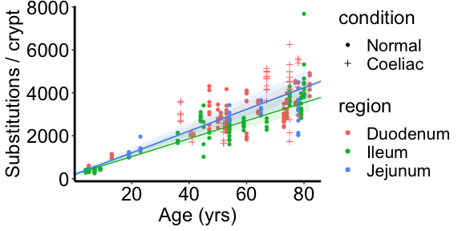<!-- -->

### Indels
As above, we set up a linear mixed model for Indels with age as a fixed effect and patient as random effect.

```r
lmm.id.age <- lme(indel_count_adj ~ age, random = list(patient = pdDiag(form = ~age -
    1)), data = df_regression, method = "ML")
```

Adding seperate mutaion rate for duodenum/jejunum/ileum significantly improves the fitness of the model.

```r
# Whether biopsy regions affect Indel burden via burden
lmm.id.region.burden <- lme(indel_count_adj ~ age:region, random = list(patient = pdDiag(form = ~age -
    1)), data = df_regression, method = "ML")
anova(lmm.id.region.burden, lmm.id.age)
```

```
##                      Model df      AIC      BIC    logLik   Test  L.Ratio
## lmm.id.region.burden     1  6 3398.130 3420.471 -1693.065                
## lmm.id.age               2  4 3411.893 3426.787 -1701.947 1 vs 2 17.76319
##                      p-value
## lmm.id.region.burden        
## lmm.id.age             1e-04
```


No significant inter-patient variation and heteroscedasticity is caused by different biopsy sections.

```r
# Biopsy region does not affect between-patient variation of Indels
lmm.id.region.burden.var.inter <- lme(indel_count_adj ~ age:region, random = list(patient = pdDiag(form = ~age +
    region - 1)), data = df_regression, method = "ML")
anova(lmm.id.region.burden.var.inter, lmm.id.region.burden)
```

```
##                                Model df      AIC      BIC    logLik   Test
## lmm.id.region.burden.var.inter     1  9 3401.407 3434.919 -1691.704       
## lmm.id.region.burden               2  6 3398.130 3420.471 -1693.065 1 vs 2
##                                 L.Ratio p-value
## lmm.id.region.burden.var.inter                 
## lmm.id.region.burden           2.722704  0.4364
```

```r
# Biopsy region does not affect within-patient variation of
# Indels.The ANNOVA test result is not significant after removing
# possible outliers.
lmm.id.region.burden.var.intra <- lme(indel_count_adj ~ age:region, random = list(patient = pdDiag(form = ~age -
    1)), weights = varIdent(form = ~1 | region), data = df_regression,
    method = "ML")
anova(lmm.id.region.burden.var.intra, lmm.id.region.burden)
```

```
##                                Model df     AIC      BIC    logLik   Test
## lmm.id.region.burden.var.intra     1  8 3365.18 3394.969 -1674.590       
## lmm.id.region.burden               2  6 3398.13 3420.471 -1693.065 1 vs 2
##                                L.Ratio p-value
## lmm.id.region.burden.var.intra                
## lmm.id.region.burden           36.9496  <.0001
```

```r
lmm.id.region.burden <- lme(indel_count_adj ~ age:region, random = list(patient = pdDiag(form = ~age -
    1)), data = df_regression[which(df_regression$patient != "PD46565"),
    ], method = "ML")
lmm.id.region.burden.var.intra <- lme(indel_count_adj ~ age:region, random = list(patient = pdDiag(form = ~age -
    1)), weights = varIdent(form = ~1 | region), data = df_regression[which(df_regression$patient !=
    "PD46565"), ], method = "ML")
anova(lmm.id.region.burden.var.intra, lmm.id.region.burden)
```

```
##                                Model df      AIC      BIC    logLik   Test
## lmm.id.region.burden.var.intra     1  8 3141.924 3171.419 -1562.962       
## lmm.id.region.burden               2  6 3141.019 3163.141 -1564.509 1 vs 2
##                                 L.Ratio p-value
## lmm.id.region.burden.var.intra                 
## lmm.id.region.burden           3.095223  0.2128
```


Coeliac history affects Indel burdens and intra-patient variation.

```r
# Coeliac history affects Indel burdens
lmm.id.region.burden <- lme(indel_count_adj ~ age:region, random = list(patient = pdDiag(form = ~age -
    1)), data = df_regression, method = "ML")
lmm.id.region.burden.coeliac.burden <- lme(indel_count_adj ~ age:region +
    condition, random = list(patient = pdDiag(form = ~age - 1)), data = df_regression,
    method = "ML")
anova(lmm.id.region.burden.coeliac.burden, lmm.id.region.burden)
```

```
##                                     Model df      AIC      BIC    logLik   Test
## lmm.id.region.burden.coeliac.burden     1  7 3393.912 3419.977 -1689.956       
## lmm.id.region.burden                    2  6 3398.130 3420.471 -1693.065 1 vs 2
##                                      L.Ratio p-value
## lmm.id.region.burden.coeliac.burden                 
## lmm.id.region.burden                6.217716  0.0126
```

```r
# Coeliac history does not affect inter-patient variation of Indels
# (the effect no longer exist after removing one outlier.)
lmm.id.region.burden.coeliac.var.inter <- lme(indel_count_adj ~ age:region +
    condition, random = list(patient = pdDiag(form = ~age + condition -
    1)), weights = varIdent(form = ~1 | region), data = df_regression,
    method = "ML")
lmm.id.region.burden.coeliac.burden <- lme(indel_count_adj ~ age:region +
    condition, random = list(patient = pdDiag(form = ~age - 1)), data = df_regression,
    method = "ML")
anova(lmm.id.region.burden.coeliac.var.inter, lmm.id.region.burden.coeliac.burden)
```

```
##                                        Model df      AIC      BIC    logLik
## lmm.id.region.burden.coeliac.var.inter     1 11 3362.787 3403.746 -1670.393
## lmm.id.region.burden.coeliac.burden        2  7 3393.912 3419.977 -1689.956
##                                          Test  L.Ratio p-value
## lmm.id.region.burden.coeliac.var.inter                        
## lmm.id.region.burden.coeliac.burden    1 vs 2 39.12523  <.0001
```

```r
lmm.id.region.burden.coeliac.var.inter <- lme(indel_count_adj ~ age:region +
    condition, random = list(patient = pdDiag(form = ~age + condition -
    1)), weights = varIdent(form = ~1 | region), data = df_regression[which(df_regression$patient !=
    "PD46565"), ], method = "ML")
lmm.id.region.burden.coeliac.burden <- lme(indel_count_adj ~ age:region +
    condition, random = list(patient = pdDiag(form = ~age - 1)), data = df_regression[which(df_regression$patient !=
    "PD46565"), ], method = "ML")
anova(lmm.id.region.burden.coeliac.var.inter, lmm.id.region.burden.coeliac.burden)
```

```
##                                        Model df      AIC      BIC    logLik
## lmm.id.region.burden.coeliac.var.inter     1 11 3139.137 3179.694 -1558.569
## lmm.id.region.burden.coeliac.burden        2  7 3137.245 3163.054 -1561.623
##                                          Test  L.Ratio p-value
## lmm.id.region.burden.coeliac.var.inter                        
## lmm.id.region.burden.coeliac.burden    1 vs 2 6.108064  0.1912
```

```r
# Coeliac history affects intra-patient variation of Indels. The
# effect exist after removing possible outliers.
lmm.id.region.burden.coeliac.burden.var.intra <- lme(indel_count_adj ~
    age:region + condition, random = list(patient = pdDiag(form = ~age -
    1)), weights = varIdent(form = ~1 | condition), data = df_regression,
    method = "ML")
lmm.id.region.burden.coeliac.burden <- lme(indel_count_adj ~ age:region +
    condition, random = list(patient = pdDiag(form = ~age - 1)), data = df_regression,
    method = "ML")
anova(lmm.id.region.burden.coeliac.burden.var.intra, lmm.id.region.burden.coeliac.burden)
```

```
##                                               Model df      AIC      BIC
## lmm.id.region.burden.coeliac.burden.var.intra     1  8 3306.525 3336.314
## lmm.id.region.burden.coeliac.burden               2  7 3393.912 3419.977
##                                                  logLik   Test  L.Ratio p-value
## lmm.id.region.burden.coeliac.burden.var.intra -1645.263                        
## lmm.id.region.burden.coeliac.burden           -1689.956 1 vs 2 89.38675  <.0001
```

```r
lmm.id.region.burden.coeliac.burden.var.intra <- lme(indel_count_adj ~
    age:region + condition, random = list(patient = pdDiag(form = ~age -
    1)), weights = varIdent(form = ~1 | condition), data = df_regression[which(df_regression$patient !=
    "PD46565"), ], method = "ML")
lmm.id.region.burden.coeliac.burden <- lme(indel_count_adj ~ age:region +
    condition, random = list(patient = pdDiag(form = ~age - 1)), data = df_regression[which(df_regression$patient !=
    "PD46565"), ], method = "ML")
anova(lmm.id.region.burden.coeliac.burden.var.intra, lmm.id.region.burden.coeliac.burden)
```

```
##                                               Model df      AIC      BIC
## lmm.id.region.burden.coeliac.burden.var.intra     1  8 3129.663 3159.159
## lmm.id.region.burden.coeliac.burden               2  7 3137.245 3163.054
##                                                  logLik   Test  L.Ratio p-value
## lmm.id.region.burden.coeliac.burden.var.intra -1556.832                        
## lmm.id.region.burden.coeliac.burden           -1561.623 1 vs 2 9.582385   0.002
```


Therefore, our final model for ID burden includes age, biopsy region and coeliac condition as fixed effects, patient as a random effect, and use different covariance matrix for individual with/without a coeliac history.


```r
lmm.id.region.burden.coeliac.burden.var.intra <- lme(indel_count_adj ~
    age:region + condition, random = list(patient = pdDiag(form = ~age -
    1)), weights = varIdent(form = ~1 | condition), data = df_regression,
    method = "ML")

lmm <- lmm.id.region.burden.coeliac.burden.var.intra
summary(lmm)
```

```
## Linear mixed-effects model fit by maximum likelihood
##  Data: df_regression 
##        AIC      BIC    logLik
##   3306.525 3336.314 -1645.263
## 
## Random effects:
##  Formula: ~age - 1 | patient
##              age Residual
## StdDev: 1.243446 37.70072
## 
## Variance function:
##  Structure: Different standard deviations per stratum
##  Formula: ~1 | condition 
##  Parameter estimates:
##  Normal Coeliac 
## 1.00000 2.47135 
## Fixed effects: indel_count_adj ~ age:region + condition 
##                       Value Std.Error  DF   t-value p-value
## (Intercept)        25.18567   7.37832 265  3.413469  0.0007
## conditionCoeliac   80.49719  33.66742  36  2.390952  0.0222
## age:regionDuodenum  3.70883   0.33674 265 11.013825  0.0000
## age:regionIleum     2.27619   0.36334 265  6.264571  0.0000
## age:regionJejunum   2.64440   0.43150 265  6.128334  0.0000
##  Correlation: 
##                    (Intr) cndtnC ag:rgD ag:rgI
## conditionCoeliac    0.054                     
## age:regionDuodenum -0.534 -0.395              
## age:regionIleum    -0.563 -0.188  0.608       
## age:regionJejunum  -0.455 -0.170  0.528  0.566
## 
## Standardized Within-Group Residuals:
##         Min          Q1         Med          Q3         Max 
## -5.55496084 -0.37856104 -0.01098294  0.35905899  4.87193646 
## 
## Number of Observations: 306
## Number of Groups: 38
```

```r
fixed.m1 <- data.frame(fixef(lmm))


tmp = data.frame(condition = c(16, 3))
tmp_name = c("Coeliac", "Normal")
rownames(tmp) = tmp_name

ggplot(data = df_regression, mapping = aes(x = age, y = indel_count_adj)) +
    geom_point(aes(colour = region, fill = region, shape = condition)) +
    theme_bw() + theme(panel.grid = element_blank(), panel.border = element_blank(),
    axis.line = element_line(size = 1, colour = "black")) + scale_shape_manual(values = tmp$condition) +
    geom_abline(intercept = fixed.m1[1, ], slope = fixed.m1["age:regionDuodenum",
        ], colour = "#F8766D") + geom_ribbon(aes(ymin = fixed.m1[1, ] +
    age * intervals(lmm, which = "fixed")[["fixed"]]["age:regionDuodenum",
        "lower"], ymax = fixed.m1[1, ] + age * intervals(lmm, which = "fixed")[["fixed"]]["age:regionDuodenum",
    "upper"]), fill = "#F8766D", alpha = 0.1) + geom_abline(intercept = fixed.m1[1,
    ], slope = fixed.m1["age:regionIleum", ], colour = "#00B81F") + geom_ribbon(aes(ymin = fixed.m1[1,
    ] + age * intervals(lmm, which = "fixed")[["fixed"]]["age:regionIleum",
    "lower"], ymax = fixed.m1[1, ] + age * intervals(lmm, which = "fixed")[["fixed"]]["age:regionIleum",
    "upper"]), fill = "#00B81F", alpha = 0.1) + geom_abline(intercept = fixed.m1[1,
    ], slope = fixed.m1["age:regionJejunum", ], colour = "#00A5FF") + geom_ribbon(aes(ymin = fixed.m1[1,
    ] + age * intervals(lmm, which = "fixed")[["fixed"]]["age:regionJejunum",
    "lower"], ymax = fixed.m1[1, ] + age * intervals(lmm, which = "fixed")[["fixed"]]["age:regionJejunum",
    "upper"]), fill = "#00A5FF", alpha = 0.1) + labs(y = "Indels / crypt",
    x = "Age (yrs)") + theme(title = element_text(size = 18), axis.text.y = element_text(size = 18,
    color = "black"), axis.text.x = element_text(size = 18, color = "black"),
    legend.text = element_text(size = 16))
```

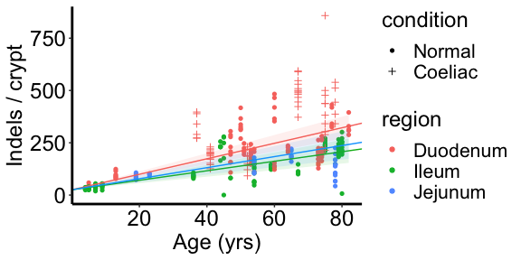<!-- -->


## 3. Mosaic plot for all signatures

```r
df = exposure_matrix_crypts[rownames(exposure_matrix_crypts) %in% data$sample,
    ]
df$patient = rownames(df)
df$age = data$age
df$patient = fct_reorder(df$patient, df$age, min)

test <- gather(df, E1, E2, -patient, -age)
test$E1 <- factor(test$E1, levels = c("SBS1", "SBS5", "SBS18", "SBS2",
    "SBS13", "SBS88", "SBS35", "SBS40", "SBS41", "SBS17b"))
test$group = "Normal"
test$group[test$patient %in% data$sample[data$condition == "Coeliac"]] = "Coeliac"

sig_order = 1:10
names(sig_order) = c("SBS1", "SBS5", "SBS18", "SBS2", "SBS13", "SBS88",
    "SBS35", "SBS40", "SBS41", "SBS17b")
final_sigs = t(read.table("./data/signatures/final_sigs.txt", check.names = FALSE))

getPalette = colorRampPalette(brewer.pal(8, "Set3"))
all_cols = getPalette(8)
all_cols = c(all_cols, "firebrick", "magenta")
final_sigs = final_sigs[names(sort(sig_order[rownames(final_sigs)])), ]
names(all_cols) = rownames(final_sigs)

ggplot(test, aes(x = patient, y = E2, fill = E1)) + geom_bar(stat = "identity") +
    scale_fill_manual(values = all_cols) + theme_bw() + theme(axis.text.x = element_blank(),
    axis.ticks.x = element_blank(), panel.grid = element_blank(), panel.border = element_blank()) +
    labs(x = "Samples", y = "Proportion", fill = "Signatures") + facet_grid(cols = vars(group),
    scales = "free_x", space = "free")
```

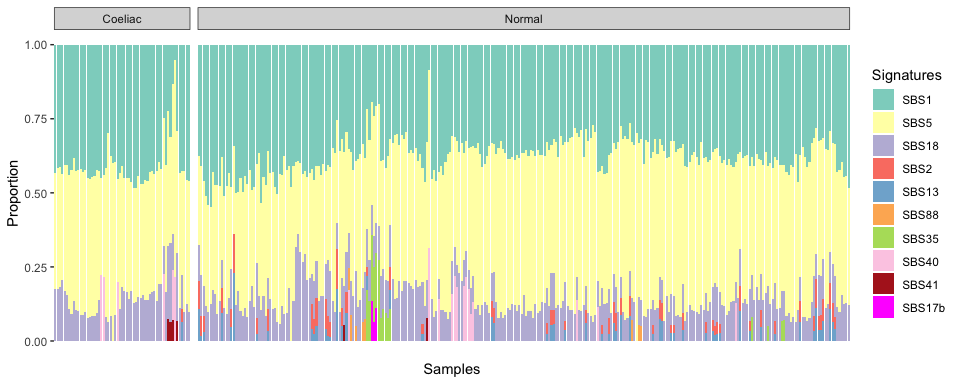<!-- -->

## 4. The presence of APOBEC signatures SBS2/13 in the small intestine

```r
exposure_matrix_all = read.table("../../small_bowel/data/sigs/exposure_matrix_with_colon.txt",
    header = T, stringsAsFactors = F)
input_for_hdp <- read.table("../../small_bowel/data/input_for_hdp.txt",
    check.names = F)
input_for_hdp = input_for_hdp[apply(input_for_hdp, 1, sum) > 50, ]
input_for_hdp = input_for_hdp[!(rownames(input_for_hdp) %in% c("PD43851_1",
    "PD43851_4", "PD43851_14")), ]

apobec_table = data.frame(matrix(ncol = 2, nrow = length(unique(data$patient))))
rownames(apobec_table) = unique(data$patient)
colnames(apobec_table) = c("Positive", "Negative")
for (patient in unique(data$patient)) {
    apobec_table[patient, "Positive"] = sum(sum(data[data$patient == patient,
        "SBS2"] + data[data$patient == patient, "SBS13"] > 0.05 * data[data$patient ==
        patient, "sbs_count_adj"]))
    apobec_table[patient, "Negative"] = sum(data$patient == patient) -
        apobec_table[patient, "Positive"]
}

APOBEC_matrix_all = exposure_matrix_all[, c("SBS2", "SBS13")]
APOBEC_matrix_all$sum = APOBEC_matrix_all$SBS2 + APOBEC_matrix_all$SBS13
APOBEC_matrix_all$sum[APOBEC_matrix_all$sum < 0.05] = 0
APOBEC_matrix_all$group = "Colon"
APOBEC_matrix_all$group[rownames(exposure_matrix_all) %in% rownames(input_for_hdp)] = "Small intestine"
APOBEC_matrix_all$branch = rownames(APOBEC_matrix_all)

df = data.frame(matrix(ncol = 3, nrow = 2))
colnames(df) <- c("region", "pos", "neg")
df$region = c("Small intestine", "Colon")
df$pos = c(sum(APOBEC_matrix_all$sum[APOBEC_matrix_all$group == "Small intestine"] >
    0), sum(APOBEC_matrix_all$sum[APOBEC_matrix_all$group == "Colon"] >
    0))
df$neg = c(sum(APOBEC_matrix_all$sum[APOBEC_matrix_all$group == "Small intestine"] ==
    0), sum(APOBEC_matrix_all$sum[APOBEC_matrix_all$group == "Colon"] ==
    0))


df[1, 2:3] = df[1, 2:3]/sum(df[1, 2:3])
df[2, 2:3] = df[2, 2:3]/sum(df[2, 2:3])

test <- gather(df, E1, E2, -region)
test$E1 <- factor(test$E1, levels = c("pos", "neg"))


ggplot(test[test$E1 == "pos", ]) + geom_bar(aes(x = region, y = E2, fill = E1),
    stat = "identity") + scale_fill_brewer(palette = "Paired", labels = c("APOBEC positive",
    "APOBEC negative")) + theme_bw() + theme(panel.grid = element_blank(),
    legend.position = "none", legend.title = element_blank(), panel.border = element_blank(),
    axis.line = element_line(size = 1, colour = "black")) + labs(x = "Location",
    y = "APOBEC frequency")
```

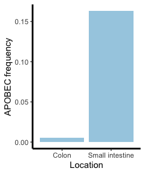<!-- -->

```r
# aa=chisq.test(rbind(c(68,417-68),c(6,1075-6)))
# aa=chisq.test(rbind(c(37,417-37),c(3,1066-3)))
```

## 5. Mutational burden for common mutational signatures in the normal small intestine
We looked into the accumulation of mutational buren across the corhort for SBS1, SBS5, SBS18 and SBS2/13. Other sporadic signatures are too rare for conducting meaningful statistical analysis.

### SBS1

The accumulation of SBS1 burden is asscoicated with age and differs in diifferent biopsy regions.

```r
lmm <- lme(SBS1 ~ age - 1, random = list(patient = pdDiag(form = ~age -
    1)), weights = varIdent(form = ~1), data = df_regression, method = "ML")

# Biopsy region affects SBS1 burden
lmm.region.burden <- lme(SBS1 ~ age:region - 1, random = list(patient = pdDiag(form = ~age -
    1)), data = df_regression, method = "ML")
anova(lmm.region.burden, lmm)
```

```
##                   Model df      AIC      BIC    logLik   Test L.Ratio p-value
## lmm.region.burden     1  5 4278.198 4296.816 -2134.099                       
## lmm                   2  3 4285.261 4296.432 -2139.631 1 vs 2  11.063   0.004
```

```r
summary(lmm.region.burden)
```

```
## Linear mixed-effects model fit by maximum likelihood
##  Data: df_regression 
##        AIC      BIC    logLik
##   4278.198 4296.816 -2134.099
## 
## Random effects:
##  Formula: ~age - 1 | patient
##              age Residual
## StdDev: 4.732852  227.187
## 
## Fixed effects: SBS1 ~ age:region - 1 
##                       Value Std.Error  DF  t-value p-value
## age:regionDuodenum 21.49825  1.053463 266 20.40722       0
## age:regionIleum    16.45576  1.317945 266 12.48592       0
## age:regionJejunum  19.53773  1.859927 266 10.50457       0
##  Correlation: 
##                   ag:rgD ag:rgI
## age:regionIleum   0.214        
## age:regionJejunum 0.183  0.243 
## 
## Standardized Within-Group Residuals:
##        Min         Q1        Med         Q3        Max 
## -5.5992782 -0.3871718  0.1182177  0.4244550  4.2132845 
## 
## Number of Observations: 306
## Number of Groups: 38
```

```r
# Coeliac history affects SBS1 burden, therefore we need to estimate
# SBS mutational rate seperately
lmm.coeliac.burden <- lme(SBS1 ~ age:region + condition - 1, random = list(patient = pdDiag(form = ~age -
    1)), data = df_regression, method = "ML")
anova(lmm.coeliac.burden, lmm.region.burden)
```

```
##                    Model df      AIC      BIC    logLik   Test  L.Ratio p-value
## lmm.coeliac.burden     1  7 4269.351 4295.416 -2127.675                        
## lmm.region.burden      2  5 4278.198 4296.816 -2134.099 1 vs 2 12.84746  0.0016
```

```r
lmm.region.burden <- lme(SBS1 ~ age:region - 1, random = list(patient = pdDiag(form = ~age -
    1)), data = df_regression[which(df_regression$condition == "Normal"),
    ], method = "ML")

lmm <- lmm.region.burden
fixed.m1 <- data.frame(fixef(lmm))
summary(lmm)
```

```
## Linear mixed-effects model fit by maximum likelihood
##  Data: df_regression[which(df_regression$condition == "Normal"), ] 
##        AIC      BIC    logLik
##   3358.888 3376.476 -1674.444
## 
## Random effects:
##  Formula: ~age - 1 | patient
##              age Residual
## StdDev: 4.040876    175.6
## 
## Fixed effects: SBS1 ~ age:region - 1 
##                       Value Std.Error  DF  t-value p-value
## age:regionDuodenum 20.37133  1.024132 215 19.89132       0
## age:regionIleum    16.10719  1.098088 215 14.66839       0
## age:regionJejunum  19.28576  1.514595 215 12.73328       0
##  Correlation: 
##                   ag:rgD ag:rgI
## age:regionIleum   0.286        
## age:regionJejunum 0.243  0.286 
## 
## Standardized Within-Group Residuals:
##        Min         Q1        Med         Q3        Max 
## -2.8032062 -0.4644485  0.1549532  0.4870106  5.4502803 
## 
## Number of Observations: 249
## Number of Groups: 32
```

```r
cor(df_regression$SBS1[which(df_regression$condition == "Normal")], df_regression$age[which(df_regression$condition ==
    "Normal")], method = "pearson")
```

```
## [1] 0.8463669
```

```r
tmp = data.frame(condition = c(16, 3))
tmp_name = c("Coeliac", "Normal")
rownames(tmp) = tmp_name

ggplot(data = df_regression, mapping = aes(x = age, y = SBS1)) + geom_point(aes(colour = region,
    fill = region, shape = condition)) + theme_bw() + theme(panel.grid = element_blank(),
    panel.border = element_blank(), axis.line = element_line(size = 1,
        colour = "black")) + scale_shape_manual(values = tmp$condition) +
    geom_abline(intercept = 0, slope = fixed.m1["age:regionDuodenum", ],
        colour = "#F8766D") + geom_ribbon(aes(ymin = age * intervals(lmm,
    which = "fixed")[["fixed"]]["age:regionDuodenum", "lower"], ymax = age *
    intervals(lmm, which = "fixed")[["fixed"]]["age:regionDuodenum", "upper"]),
    fill = "#F8766D", alpha = 0.1) + geom_abline(intercept = 0, slope = fixed.m1["age:regionIleum",
    ], colour = "#00B81F") + geom_ribbon(aes(ymin = age * intervals(lmm,
    which = "fixed")[["fixed"]]["age:regionIleum", "lower"], ymax = age *
    intervals(lmm, which = "fixed")[["fixed"]]["age:regionIleum", "upper"]),
    fill = "#00B81F", alpha = 0.1) + geom_abline(intercept = 0, slope = fixed.m1["age:regionJejunum",
    ], colour = "#00A5FF") + geom_ribbon(aes(ymin = age * intervals(lmm,
    which = "fixed")[["fixed"]]["age:regionJejunum", "lower"], ymax = age *
    intervals(lmm, which = "fixed")[["fixed"]]["age:regionJejunum", "upper"]),
    fill = "#00A5FF", alpha = 0.1) + labs(y = "SBS1 burden / crypt", x = "Age (yrs)") +
    theme(title = element_text(size = 18), axis.text.y = element_text(size = 18,
        color = "black"), axis.text.x = element_text(size = 18, color = "black"),
        legend.text = element_text(size = 16))
```

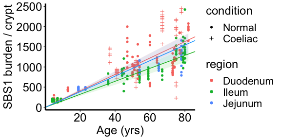<!-- -->


### SBS5

The accumulation of SBS5 burden is asscoicated with age, but shows no difference across the three sections.

```r
lmm <- lme(SBS5 ~ age, random = list(patient = pdDiag(form = ~age - 1)),
    weights = varIdent(form = ~1), data = df_regression, method = "ML")

# Coeliac history does not affect SBS5 burden
lmm.coeliac.burden <- lme(SBS5 ~ age + condition, random = list(patient = pdDiag(form = ~age -
    1)), data = df_regression, method = "ML")
anova(lmm.coeliac.burden, lmm)
```

```
##                    Model df      AIC      BIC   logLik   Test   L.Ratio p-value
## lmm.coeliac.burden     1  5 4206.541 4225.159 -2098.27                         
## lmm                    2  4 4205.480 4220.374 -2098.74 1 vs 2 0.9387122  0.3326
```

```r
# Biopsy region does not affect SBS5 burden
lmm.region.burden <- lme(SBS5 ~ age:region, random = list(patient = pdDiag(form = ~age -
    1)), data = df_regression, method = "ML")
anova(lmm.region.burden, lmm)
```

```
##                   Model df      AIC      BIC    logLik   Test  L.Ratio p-value
## lmm.region.burden     1  6 4204.759 4227.100 -2096.379                        
## lmm                   2  4 4205.480 4220.374 -2098.740 1 vs 2 4.720773  0.0944
```

```r
fixed.m1 <- data.frame(fixef(lmm))
intervals(lmm, which = "fixed")
```

```
## Approximate 95% confidence intervals
## 
##  Fixed effects:
##                 lower     est.    upper
## (Intercept) -37.21206 29.12556 95.46319
## age          21.76516 23.60751 25.44987
## attr(,"label")
## [1] "Fixed effects:"
```

```r
cor(df_regression$SBS5, df_regression$age, method = "pearson")
```

```
## [1] 0.8975935
```

```r
tmp = data.frame(condition = c(16, 3))
tmp_name = c("Coeliac", "Normal")
rownames(tmp) = tmp_name

ggplot(data = df_regression, mapping = aes(x = age, y = SBS5)) + geom_point(aes(colour = region,
    fill = region, shape = condition)) + theme_bw() + theme(panel.grid = element_blank(),
    panel.border = element_blank(), axis.line = element_line(size = 1,
        colour = "black")) + scale_shape_manual(values = tmp$condition) +
    geom_abline(intercept = fixed.m1[1, ], slope = fixed.m1["age", ]) +
    geom_ribbon(aes(ymin = fixed.m1[1, ] + age * intervals(lmm, which = "fixed")[["fixed"]]["age",
        "lower"], ymax = fixed.m1[1, ] + age * intervals(lmm, which = "fixed")[["fixed"]]["age",
        "upper"]), alpha = 0.1) + labs(y = "SBS5 burden / crypt", x = "Age (yrs)") +
    theme(title = element_text(size = 18), axis.text.y = element_text(size = 18,
        color = "black"), axis.text.x = element_text(size = 18, color = "black"),
        legend.text = element_text(size = 16))
```

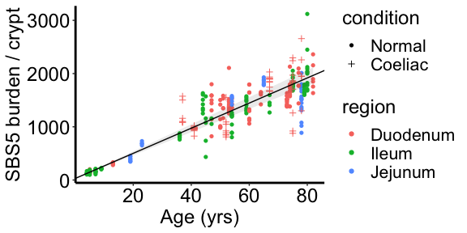<!-- -->

### SBS18

The accumulation of SBS18 burden is asscoicated with age, but shows no difference across the three sections.

```r
lmm <- lme(SBS18 ~ age, random = list(patient = pdDiag(form = ~age - 1)),
    weights = varIdent(form = ~1), data = df_regression, method = "ML")

# Coeliac history does not affect SBS18 burden
lmm.coeliac.burden <- lme(SBS18 ~ age + condition, random = list(patient = pdDiag(form = ~age -
    1)), data = df_regression, method = "ML")
anova(lmm.coeliac.burden, lmm)
```

```
##                    Model df      AIC      BIC    logLik   Test L.Ratio p-value
## lmm.coeliac.burden     1  5 3914.617 3933.235 -1952.308                       
## lmm                    2  4 3915.435 3930.329 -1953.718 1 vs 2  2.8183  0.0932
```

```r
# Biopsy region does not affect SBS18 burden
lmm.region.burden <- lme(SBS18 ~ age:region, random = list(patient = pdDiag(form = ~age -
    1)), data = df_regression, method = "ML")
anova(lmm.region.burden, lmm)
```

```
##                   Model df      AIC      BIC    logLik   Test  L.Ratio p-value
## lmm.region.burden     1  6 3917.554 3939.895 -1952.777                        
## lmm                   2  4 3915.435 3930.329 -1953.718 1 vs 2 1.881293  0.3904
```

```r
fixed.m1 <- data.frame(fixef(lmm))
intervals(lmm, which = "fixed")
```

```
## Approximate 95% confidence intervals
## 
##  Fixed effects:
##                 lower      est.     upper
## (Intercept) -1.237668 41.205059 83.647787
## age          4.109363  5.464951  6.820539
## attr(,"label")
## [1] "Fixed effects:"
```

```r
cor(df_regression$SBS18, df_regression$age, method = "pearson")
```

```
## [1] 0.574769
```

```r
tmp = data.frame(condition = c(16, 3))
tmp_name = c("Coeliac", "Normal")
rownames(tmp) = tmp_name

ggplot(data = df_regression, mapping = aes(x = age, y = SBS18)) + geom_point(aes(colour = region,
    fill = region, shape = condition)) + theme_bw() + theme(panel.grid = element_blank(),
    panel.border = element_blank(), axis.line = element_line(size = 1,
        colour = "black")) + scale_shape_manual(values = tmp$condition) +
    geom_abline(intercept = fixed.m1[1, ], slope = fixed.m1["age", ]) +
    geom_ribbon(aes(ymin = fixed.m1[1, ] + age * intervals(lmm, which = "fixed")[["fixed"]]["age",
        "lower"], ymax = fixed.m1[1, ] + age * intervals(lmm, which = "fixed")[["fixed"]]["age",
        "upper"]), alpha = 0.1) + labs(y = "SBS18 burden / crypt", x = "Age (yrs)") +
    theme(title = element_text(size = 18), axis.text.y = element_text(size = 18,
        color = "black"), axis.text.x = element_text(size = 18, color = "black"),
        legend.text = element_text(size = 16))
```

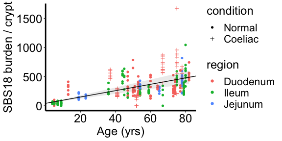<!-- -->

### SBS2/13

The accumulation of SBS2 burden has a non-linear relationship with age.

```r
lmm <- lme(SBS2 ~ age, random = list(patient = pdDiag(form = ~age - 1)),
    weights = varIdent(form = ~1), data = df_regression, method = "ML")


# Coeliac history does not affect SBS2 burden
lmm.coeliac.burden <- lme(SBS2 ~ age + condition, random = list(patient = pdDiag(form = ~age -
    1)), data = df_regression, method = "ML")
anova(lmm.coeliac.burden, lmm)
```

```
##                    Model df      AIC      BIC    logLik   Test  L.Ratio p-value
## lmm.coeliac.burden     1  5 3447.171 3465.789 -1718.586                        
## lmm                    2  4 3447.453 3462.348 -1719.727 1 vs 2 2.282007  0.1309
```

```r
# Biopsy region does not affect SBS2 burden
lmm.region.burden <- lme(SBS2 ~ age:region, random = list(patient = pdDiag(form = ~age -
    1)), data = df_regression, method = "ML")
anova(lmm.region.burden, lmm)
```

```
##                   Model df      AIC      BIC    logLik   Test  L.Ratio p-value
## lmm.region.burden     1  6 3447.208 3469.550 -1717.604                        
## lmm                   2  4 3447.453 3462.348 -1719.727 1 vs 2 4.244812  0.1197
```

```r
fixed.m1 <- data.frame(fixef(lmm))
intervals(lmm, which = "fixed")
```

```
## Approximate 95% confidence intervals
## 
##  Fixed effects:
##                    lower      est.      upper
## (Intercept) -11.97123388 6.7875973 25.5464285
## age          -0.07758137 0.3658999  0.8093812
## attr(,"label")
## [1] "Fixed effects:"
```

```r
cor(df_regression$SBS2, df_regression$age, method = "pearson")
```

```
## [1] 0.1904416
```

```r
tmp = data.frame(condition = c(16, 3))
tmp_name = c("Coeliac", "Normal")
rownames(tmp) = tmp_name

ggplot(data = df_regression, mapping = aes(x = age, y = SBS2)) + geom_point(aes(colour = region,
    fill = region, shape = condition)) + theme_bw() + theme(panel.grid = element_blank(),
    panel.border = element_blank(), axis.line = element_line(size = 1,
        colour = "black")) + scale_shape_manual(values = tmp$condition) +
    labs(y = "SBS2 burden / crypt", x = "Age (yrs)") + theme(title = element_text(size = 18),
    axis.text.y = element_text(size = 18, color = "black"), axis.text.x = element_text(size = 18,
        color = "black"), legend.text = element_text(size = 16))
```

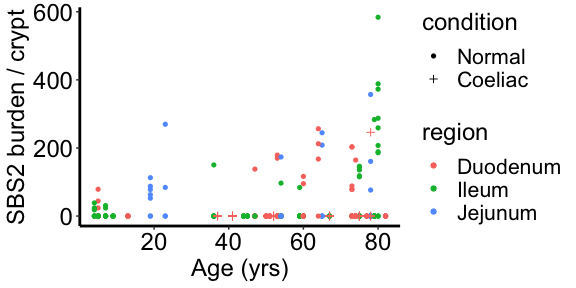<!-- -->

The accumulation of SBS13 burden has a non-linear relationship with age.

```r
lmm <- lme(SBS13 ~ age, random = list(patient = pdDiag(form = ~age - 1)),
    weights = varIdent(form = ~1), data = df_regression, method = "ML")

# Coeliac history does not affect SBS13 burden
lmm.coeliac.burden <- lme(SBS13 ~ age + condition, random = list(patient = pdDiag(form = ~age -
    1)), data = df_regression, method = "ML")
anova(lmm.coeliac.burden, lmm)
```

```
##                    Model df      AIC      BIC    logLik   Test L.Ratio p-value
## lmm.coeliac.burden     1  5 3488.035 3506.653 -1739.017                       
## lmm                    2  4 3487.916 3502.811 -1739.958 1 vs 2 1.88141  0.1702
```

```r
# Biopsy region does not affect SBS13 burden
lmm.region.burden <- lme(SBS13 ~ age:region, random = list(patient = pdDiag(form = ~age -
    1)), data = df_regression, method = "ML")
anova(lmm.region.burden, lmm)
```

```
##                   Model df      AIC      BIC    logLik   Test  L.Ratio p-value
## lmm.region.burden     1  6 3487.072 3509.413 -1737.536                        
## lmm                   2  4 3487.916 3502.811 -1739.958 1 vs 2 4.844738  0.0887
```

```r
fixed.m1 <- data.frame(fixef(lmm))
intervals(lmm, which = "fixed")
```

```
## Approximate 95% confidence intervals
## 
##  Fixed effects:
##                   lower      est.      upper
## (Intercept) -15.5183357 4.3590460 24.2364276
## age          -0.0537492 0.3913451  0.8364394
## attr(,"label")
## [1] "Fixed effects:"
```

```r
cor(df_regression$SBS13, df_regression$age, method = "pearson")
```

```
## [1] 0.1827979
```

```r
tmp = data.frame(condition = c(16, 3))
tmp_name = c("Coeliac", "Normal")
rownames(tmp) = tmp_name

ggplot(data = df_regression, mapping = aes(x = age, y = SBS13)) + geom_point(aes(colour = region,
    fill = region, shape = condition)) + theme_bw() + theme(panel.grid = element_blank(),
    panel.border = element_blank(), axis.line = element_line(size = 1,
        colour = "black")) + scale_shape_manual(values = tmp$condition) +
    labs(y = "SBS13 burden / crypt", x = "Age (yrs)") + theme(title = element_text(size = 18),
    axis.text.y = element_text(size = 18, color = "black"), axis.text.x = element_text(size = 18,
        color = "black"), legend.text = element_text(size = 16))
```

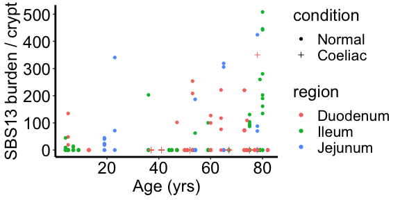<!-- -->

APOBEC burden is not correlated with reversetranposition events.

```r
lmm.APOBEC <- lme((SBS2 + SBS13) ~ age + retrotransposition + region +
    condition + gender, random = list(patient = pdDiag(form = ~age - 1)),
    data = df_regression, method = "ML")
summary(lmm.APOBEC)
```

```
## Linear mixed-effects model fit by maximum likelihood
##  Data: df_regression 
##        AIC      BIC    logLik
##   3888.471 3921.984 -1935.236
## 
## Random effects:
##  Formula: ~age - 1 | patient
##              age Residual
## StdDev: 1.063851 127.8028
## 
## Fixed effects: (SBS2 + SBS13) ~ age + retrotransposition + region + condition +      gender 
##                        Value Std.Error  DF    t-value p-value
## (Intercept)         -4.10020  26.96719 265 -0.1520439  0.8793
## age                  0.84488   0.45789  34  1.8451538  0.0737
## retrotransposition   2.06473   8.98436 265  0.2298142  0.8184
## regionIleum          6.77869  25.34866 265  0.2674180  0.7894
## regionJejunum       81.58262  35.81070 265  2.2781631  0.0235
## conditionCoeliac   -37.79433  35.73164  34 -1.0577274  0.2976
## genderMale          12.28912  24.39417  34  0.5037727  0.6177
##  Correlation: 
##                    (Intr) age    rtrtrn rgnIlm rgnJjn cndtnC
## age                -0.598                                   
## retrotransposition -0.053 -0.029                            
## regionIleum        -0.660  0.169 -0.016                     
## regionJejunum      -0.391  0.022 -0.016  0.391              
## conditionCoeliac   -0.252 -0.131 -0.073  0.336  0.245       
## genderMale         -0.249 -0.239  0.017  0.135  0.102 -0.022
## 
## Standardized Within-Group Residuals:
##          Min           Q1          Med           Q3          Max 
## -2.981208840 -0.352383279 -0.145298090 -0.005811555  5.579504852 
## 
## Number of Observations: 306
## Number of Groups: 38
```

Estimate the coeliac effect on SBS:

```r
lmm.sbs.total.coeliac.effect <- lme(sbs_count_adj ~ age:region + age:condition,
    random = list(patient = pdDiag(form = ~age - 1)), data = df_regression,
    method = "ML")
lmm.sbs1.coeliac.effect <- lme(SBS1 ~ age:region + age:condition - 1, random = list(patient = pdDiag(form = ~age -
    1)), data = df_regression, method = "ML")
lmm.sbs5.coeliac.effect <- lme(SBS5 ~ age:region + age:condition, random = list(patient = pdDiag(form = ~age -
    1)), data = df_regression, method = "ML")
lmm.sbs18.coeliac.effect <- lme(SBS18 ~ age:region + age:condition, random = list(patient = pdDiag(form = ~age -
    1)), data = df_regression, method = "ML")
lmm.apobec.coeliac.effect <- lme((SBS2 + SBS13) ~ age:region + age:condition,
    random = list(patient = pdDiag(form = ~age - 1)), data = df_regression,
    method = "ML")

summary(lmm.sbs1.coeliac.effect)
```

```
## Linear mixed-effects model fit by maximum likelihood
##  Data: df_regression 
##        AIC      BIC    logLik
##   4275.786 4298.128 -2131.893
## 
## Random effects:
##  Formula: ~age - 1 | patient
##              age Residual
## StdDev: 4.284795 227.7264
## 
## Fixed effects: SBS1 ~ age:region + age:condition - 1 
##                          Value Std.Error  DF   t-value p-value
## age:regionDuodenum   20.103699  1.147721 266 17.516186   0.000
## age:regionIleum      16.135639  1.247962 266 12.929594   0.000
## age:regionJejunum    18.966592  1.793810 266 10.573358   0.000
## age:conditionCoeliac  4.821078  2.190106  37  2.201299   0.034
##  Correlation: 
##                      ag:rgD ag:rgI ag:rgJ
## age:regionIleum       0.214              
## age:regionJejunum     0.183  0.223       
## age:conditionCoeliac -0.524 -0.112 -0.096
## 
## Standardized Within-Group Residuals:
##        Min         Q1        Med         Q3        Max 
## -5.6392741 -0.3688032  0.1283597  0.4291043  4.2123257 
## 
## Number of Observations: 306
## Number of Groups: 38
```

```r
df2 = data.frame(matrix(nrow = 10, ncol = 5))
colnames(df2) = c("rate", "type", "group", "lower_95_CI", "upper_95_CI")
df2[1, ] = c(intervals(lmm.sbs.total.coeliac.effect, which = "fixed")[["fixed"]]["age:regionDuodenum",
    "est."], "Total SBS", "Age effect", intervals(lmm.sbs.total.coeliac.effect,
    which = "fixed")[["fixed"]]["age:regionDuodenum", "lower"], intervals(lmm.sbs.total.coeliac.effect,
    which = "fixed")[["fixed"]]["age:regionDuodenum", "upper"])
df2[2, ] = c(intervals(lmm.sbs.total.coeliac.effect, which = "fixed")[["fixed"]]["age:conditionCoeliac",
    "est."], "Total SBS", "Disease effect", intervals(lmm.sbs.total.coeliac.effect,
    which = "fixed")[["fixed"]]["age:conditionCoeliac", "lower"], intervals(lmm.sbs.total.coeliac.effect,
    which = "fixed")[["fixed"]]["age:conditionCoeliac", "upper"])
df2[3, ] = c(intervals(lmm.sbs1.coeliac.effect, which = "fixed")[["fixed"]]["age:regionDuodenum",
    "est."], "SBS1", "Age effect", intervals(lmm.sbs1.coeliac.effect, which = "fixed")[["fixed"]]["age:regionDuodenum",
    "lower"], intervals(lmm.sbs1.coeliac.effect, which = "fixed")[["fixed"]]["age:regionDuodenum",
    "upper"])
df2[4, ] = c(intervals(lmm.sbs1.coeliac.effect, which = "fixed")[["fixed"]]["age:conditionCoeliac",
    "est."], "SBS1", "Disease effect", intervals(lmm.sbs1.coeliac.effect,
    which = "fixed")[["fixed"]]["age:conditionCoeliac", "lower"], intervals(lmm.sbs1.coeliac.effect,
    which = "fixed")[["fixed"]]["age:conditionCoeliac", "upper"])
df2[5, ] = c(intervals(lmm.sbs5.coeliac.effect, which = "fixed")[["fixed"]]["age:regionDuodenum",
    "est."], "SBS5", "Age effect", intervals(lmm.sbs5.coeliac.effect, which = "fixed")[["fixed"]]["age:regionDuodenum",
    "lower"], intervals(lmm.sbs5.coeliac.effect, which = "fixed")[["fixed"]]["age:regionDuodenum",
    "upper"])
df2[6, ] = c(intervals(lmm.sbs5.coeliac.effect, which = "fixed")[["fixed"]]["age:conditionCoeliac",
    "est."], "SBS5", "Disease effect", intervals(lmm.sbs5.coeliac.effect,
    which = "fixed")[["fixed"]]["age:conditionCoeliac", "lower"], intervals(lmm.sbs5.coeliac.effect,
    which = "fixed")[["fixed"]]["age:conditionCoeliac", "upper"])
df2[7, ] = c(intervals(lmm.sbs18.coeliac.effect, which = "fixed")[["fixed"]]["age:regionDuodenum",
    "est."], "SBS18", "Age effect", intervals(lmm.sbs18.coeliac.effect,
    which = "fixed")[["fixed"]]["age:regionDuodenum", "lower"], intervals(lmm.sbs18.coeliac.effect,
    which = "fixed")[["fixed"]]["age:regionDuodenum", "upper"])
df2[8, ] = c(intervals(lmm.sbs18.coeliac.effect, which = "fixed")[["fixed"]]["age:conditionCoeliac",
    "est."], "SBS18", "Disease effect", intervals(lmm.sbs18.coeliac.effect,
    which = "fixed")[["fixed"]]["age:conditionCoeliac", "lower"], intervals(lmm.sbs18.coeliac.effect,
    which = "fixed")[["fixed"]]["age:conditionCoeliac", "upper"])
df2[9, ] = c(intervals(lmm.apobec.coeliac.effect, which = "fixed")[["fixed"]]["age:regionDuodenum",
    "est."], "SBS2/13", "Age effect", intervals(lmm.apobec.coeliac.effect,
    which = "fixed")[["fixed"]]["age:regionDuodenum", "lower"], intervals(lmm.apobec.coeliac.effect,
    which = "fixed")[["fixed"]]["age:regionDuodenum", "upper"])
df2[10, ] = c(intervals(lmm.apobec.coeliac.effect, which = "fixed")[["fixed"]]["age:conditionCoeliac",
    "est."], "SBS2/13", "Disease effect", intervals(lmm.apobec.coeliac.effect,
    which = "fixed")[["fixed"]]["age:conditionCoeliac", "lower"], intervals(lmm.apobec.coeliac.effect,
    which = "fixed")[["fixed"]]["age:conditionCoeliac", "upper"])


df2$rate = round(as.numeric(df2$rate), digit = 2)
df2$lower_95_CI = round(as.numeric(df2$lower_95_CI), digit = 2)
df2$upper_95_CI = round(as.numeric(df2$upper_95_CI), digit = 2)
df2$type = factor(df2$type, levels = c("SBS2/13", "SBS18", "SBS5", "SBS1",
    "Total SBS"))
ggplot(df2[3:10, ], aes(x = rate, y = type, group = group, color = group)) +
    geom_point() + geom_errorbar(aes(xmin = lower_95_CI, xmax = upper_95_CI),
    width = 0.1) + theme_bw() + theme(panel.grid = element_blank(), panel.border = element_blank(),
    axis.line = element_line(size = 1, colour = "black")) + geom_vline(xintercept = 0,
    linetype = "dashed", color = "black") + labs(x = "Substitutions per year",
    y = NULL)
```

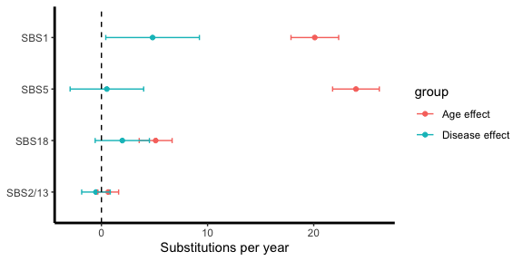<!-- -->


Estimate the coeliac effect on Indels:

```r
lmm.id.coeliac.effect <- lme(indel_count_adj ~ age:region + age:condition,
    random = list(patient = pdDiag(form = ~age - 1)), weights = varIdent(form = ~1 |
        condition), data = df_regression, method = "ML")
summary(lmm.id.coeliac.effect)
```

```
## Linear mixed-effects model fit by maximum likelihood
##  Data: df_regression 
##        AIC      BIC    logLik
##   3306.053 3335.841 -1645.026
## 
## Random effects:
##  Formula: ~age - 1 | patient
##              age Residual
## StdDev: 1.225512 37.70649
## 
## Variance function:
##  Structure: Different standard deviations per stratum
##  Formula: ~1 | condition 
##  Parameter estimates:
##   Normal  Coeliac 
## 1.000000 2.479557 
## Fixed effects: indel_count_adj ~ age:region + age:condition 
##                          Value Std.Error  DF   t-value p-value
## (Intercept)          25.738027  7.357534 265  3.498187  0.0005
## age:regionDuodenum    3.667394  0.337547 265 10.864823  0.0000
## age:regionIleum       2.248707  0.361366 265  6.222794  0.0000
## age:regionJejunum     2.613772  0.429818 265  6.081108  0.0000
## age:conditionCoeliac  1.586272  0.631632  36  2.511387  0.0167
##  Correlation: 
##                      (Intr) ag:rgD ag:rgI ag:rgJ
## age:regionDuodenum   -0.538                     
## age:regionIleum      -0.566  0.608              
## age:regionJejunum    -0.457  0.527  0.565       
## age:conditionCoeliac  0.078 -0.422 -0.206 -0.186
## 
## Standardized Within-Group Residuals:
##          Min           Q1          Med           Q3          Max 
## -5.553438222 -0.378065958 -0.006040723  0.352330596  4.822693944 
## 
## Number of Observations: 306
## Number of Groups: 38
```

```r
df3 = data.frame(matrix(nrow = 2, ncol = 5))
colnames(df3) = c("rate", "type", "group", "lower_95_CI", "upper_95_CI")
df3[1, ] = c(intervals(lmm.id.coeliac.effect, which = "fixed")[["fixed"]]["age:regionDuodenum",
    "est."], "ID", "Age effect", intervals(lmm.id.coeliac.effect, which = "fixed")[["fixed"]]["age:regionDuodenum",
    "lower"], intervals(lmm.id.coeliac.effect, which = "fixed")[["fixed"]]["age:regionDuodenum",
    "upper"])
df3[2, ] = c(intervals(lmm.id.coeliac.effect, which = "fixed")[["fixed"]]["age:conditionCoeliac",
    "est."], "ID", "Disease effect", intervals(lmm.id.coeliac.effect, which = "fixed")[["fixed"]]["age:conditionCoeliac",
    "lower"], intervals(lmm.id.coeliac.effect, which = "fixed")[["fixed"]]["age:conditionCoeliac",
    "upper"])
df3$rate = round(as.numeric(df3$rate), digit = 2)
df3$lower_95_CI = round(as.numeric(df3$lower_95_CI), digit = 2)
df3$upper_95_CI = round(as.numeric(df3$upper_95_CI), digit = 2)
ggplot(df3, aes(x = rate, y = type, group = group, color = group)) + geom_point() +
    geom_errorbar(aes(xmin = lower_95_CI, xmax = upper_95_CI), width = 0.03) +
    theme_bw() + theme(panel.grid = element_blank(), panel.border = element_blank(),
    axis.line = element_line(size = 1, colour = "black")) + geom_vline(xintercept = 0,
    linetype = "dashed", color = "black") + labs(x = "Indels per year",
    y = NULL)
```

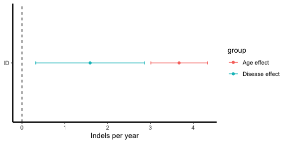<!-- -->
