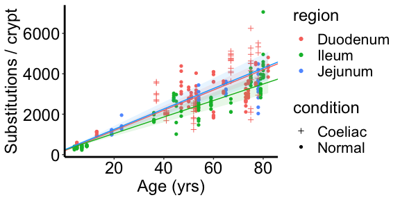
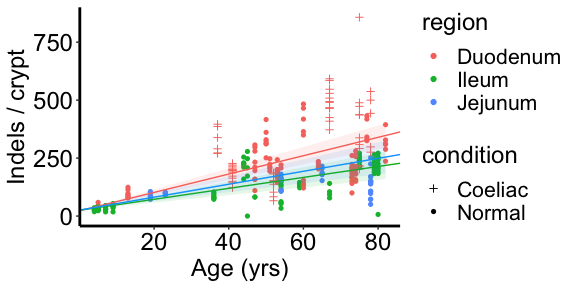
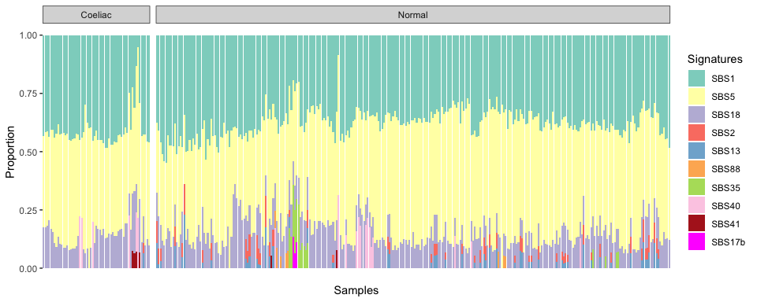
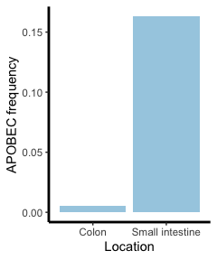
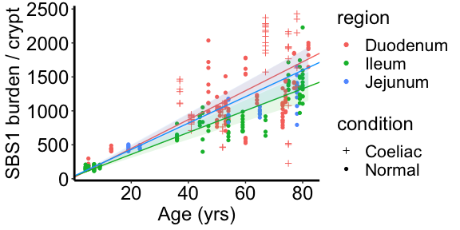
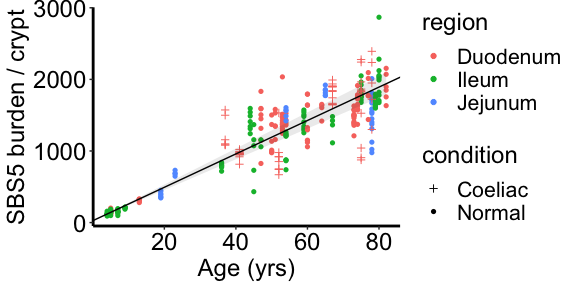
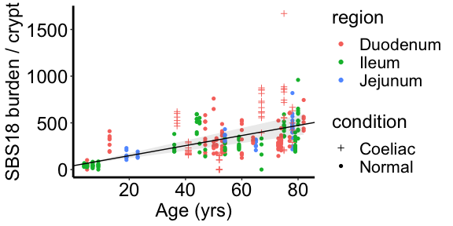
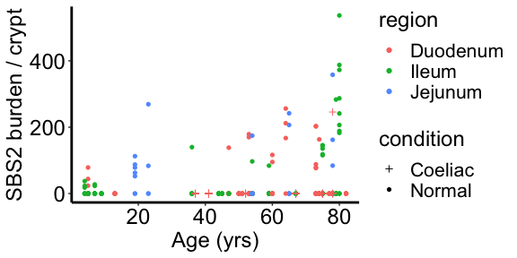
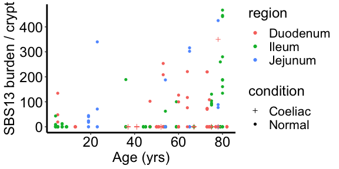

This analysis aims to assess 1) the rate of SBS and ID mutations, 2) the presence and the rate of mutaional burden of mutational sigantures in normal small intestine.

We build linear mixed models for estimating mutation rates. Model parameters encoded are: age, biopsy region (duodenum, jejunum, ileum) , celieac condition (having a coeliac history or not) and  patient. We have corrected for coverage by normalising ID and SBS mutational burden according to the sensitivity of detection in each samples before modelling, therfore we do not include it as a parameter for modelling.

## 1. Overview of the dataset


```r
library(ggplot2)
library(RColorBrewer)
library(nlme)
library(tidyverse)

# Load data
data = read.table("./data/stat_summary.txt", header = T, stringsAsFactors = F)
exposure_matrix_crypts = read.table("./data/sigs/exposure_matrix_crypts.txt",
    header = T, stringsAsFactors = F)


exposure_matrix_crypts = exposure_matrix_crypts[data$sample, ]
data$SBS1 <- data$sbs_count_adj * exposure_matrix_crypts$SBS1
data$SBS5 <- data$sbs_count_adj * exposure_matrix_crypts$SBS5
data$SBS2 <- data$sbs_count_adj * exposure_matrix_crypts$SBS2
data$SBS13 <- data$sbs_count_adj * exposure_matrix_crypts$SBS13
data$SBS18 <- data$sbs_count_adj * exposure_matrix_crypts$SBS18
data$SBS88 <- data$sbs_count_adj * exposure_matrix_crypts$SBS88
data$SBS35 <- data$sbs_count_adj * exposure_matrix_crypts$SBS35
data$SBS17b <- data$sbs_count_adj * exposure_matrix_crypts$SBS17b
data$SBS40 <- data$sbs_count_adj * exposure_matrix_crypts$SBS40
data$SBS41 <- data$sbs_count_adj * exposure_matrix_crypts$SBS41

write.table(data, "./data/stat_summary.txt", quote = F, col.names = T,
    row.names = F, sep = "\t")

# Exclude Brunner's glands
data <- data[which(data$ref == "Crypt"), ]
table(data$patient)
```

```
## 
## PD28690 PD34200 PD37266 PD37449 PD41851 PD41852 PD41853 PD42833 PD42834 PD42835 
##      21       5       6      10      11      11      11       6       7       9 
## PD43400 PD43401 PD43402 PD43403 PD43850 PD43851 PD43853 PD43949 PD43950 PD43951 
##       5       5      12       5      20      13      11       7      11      10 
## PD43952 PD43953 PD43954 PD45766 PD45767 PD45769 PD45770 PD45771 PD45773 PD45776 
##       7       7       7       7      13       5       5       6       6       6 
## PD45778 PD46562 PD46563 PD46565 PD46566 PD46568 PD46573 PD52486 PD52487 
##       4       8      13      13       6      14       5       9       5
```

```r
dim(data)
```

```
## [1] 342  26
```

```r
df_regression = data
# Only includes samples with >15 coverage
df_regression <- df_regression[which(df_regression$coverage > 15), ]
# Exclude the individual with substantial mutations from chemotherapy
df_regression <- df_regression[which(df_regression$patient != "PD43853"),
    ]

# Exclude the two unusual cases
df_regression <- df_regression[!df_regression$sample %in% c("PD46565c_lo0009",
    "PD43851j_P52_DDM_E2"), ]
rownames(df_regression) = df_regression$sample
dim(df_regression)
```

```
## [1] 306  26
```


```r
# Mean coverage
mean(data$coverage)
```

```
## [1] 25.44526
```

```r
# Load SBS matrix
sbs <- read.table("./data/sbs/sbs_on_branch.txt", check.names = F)
# Exclude Brunner's glands
sbs = sbs[!(rownames(sbs) %in% c("PD43851_1", "PD43851_4", "PD43851_14")),
    ]
# Total SBS mutations
sum(sbs)
```

```
## [1] 787109
```

```r
# Load Indel matrix
indel <- read.table("./data/indel/indel_on_branch.txt", check.names = F)
# Exclude Brunner's glands
indel = indel[!(rownames(indel) %in% c("PD43851_1", "PD43851_4", "PD43851_14")),
    ]
# Total ID mutations
sum(indel)
```

```
## [1] 51256
```

## 2. Hypothesis testing of linear mixed effects models
### Substitutions

First, we set up a linear mixed model with age as a fixed effect and patient as random effect.

```r
lmm.sbs.age <- lme(sbs_count_adj ~ age, random = list(patient = pdDiag(form = ~age -
    1)), data = df_regression, method = "ML")
```

Coeliac history does not affect single-base substitution burdens.

```r
# Include coeliac history as a fixed effect does not improve the
# fitness of model.
lmm.sbs.coeliac.burden <- lme(sbs_count_adj ~ age:condition + condition,
    random = list(patient = pdDiag(form = ~age - 1)), data = df_regression,
    method = "ML")
anova(lmm.sbs.coeliac.burden, lmm.sbs.age)
```

```
##                        Model df      AIC      BIC    logLik   Test  L.Ratio
## lmm.sbs.coeliac.burden     1  6 4755.685 4778.026 -2371.842                
## lmm.sbs.age                2  4 4755.672 4770.567 -2373.836 1 vs 2 3.987494
##                        p-value
## lmm.sbs.coeliac.burden        
## lmm.sbs.age             0.1362
```

Coeliac history does not affect between-patient heterogeneity of single-base substitution burdens.

```r
# Whether coeliac history affect inter-patient variation of single
# base substituions
lmm.sbs.coeliac.var.inter <- lme(sbs_count_adj ~ age, random = list(patient = pdDiag(form = ~age +
    condition - 1)), data = df_regression, method = "ML")
anova(lmm.sbs.coeliac.var.inter, lmm.sbs.age)
```

```
##                           Model df      AIC      BIC    logLik   Test  L.Ratio
## lmm.sbs.coeliac.var.inter     1  6 4754.624 4776.966 -2371.312                
## lmm.sbs.age                   2  4 4755.672 4770.567 -2373.836 1 vs 2 5.047765
##                           p-value
## lmm.sbs.coeliac.var.inter        
## lmm.sbs.age                0.0801
```

```r
# Whether coeliac history affect within-patient variation of single
# base substituions
lmm.sbs.coeliac.var.intra <- lme(sbs_count_adj ~ age, random = list(patient = pdDiag(form = ~age -
    1)), weights = varIdent(form = ~1 | condition), data = df_regression,
    method = "ML")
anova(lmm.sbs.coeliac.var.intra, lmm.sbs.age)
```

```
##                           Model df      AIC      BIC    logLik   Test L.Ratio
## lmm.sbs.coeliac.var.intra     1  5 4716.093 4734.711 -2353.047               
## lmm.sbs.age                   2  4 4755.672 4770.567 -2373.836 1 vs 2  41.579
##                           p-value
## lmm.sbs.coeliac.var.intra        
## lmm.sbs.age                <.0001
```

Although the p-value from ANNOVA test for heteroscedasticity between coeliac/normal groups is significant, after careful investigation into the raw data, this variation was largely introduced by one single patient, PD46565. After removing this patient, distinguishing the two groups does not provide a better fit. Therefore we don't think coeliac history will affect within-patient variation of single-base substitution burdens.


```r
lmm.sbs.age <- lme(sbs_count_adj ~ age, random = list(patient = pdDiag(form = ~age -
    1)), data = df_regression[which(df_regression$patient != "PD46565"),
    ], method = "ML")
lmm.sbs.coeliac.var.intra <- lme(sbs_count_adj ~ age, random = list(patient = pdDiag(form = ~age -
    1)), weights = varIdent(form = ~1 | condition), data = df_regression[which(df_regression$patient !=
    "PD46565"), ], method = "ML")
anova(lmm.sbs.coeliac.var.intra, lmm.sbs.age)
```

```
##                           Model df      AIC      BIC    logLik   Test  L.Ratio
## lmm.sbs.coeliac.var.intra     1  5 4501.703 4520.138 -2245.852                
## lmm.sbs.age                   2  4 4502.074 4516.822 -2247.037 1 vs 2 2.371457
##                           p-value
## lmm.sbs.coeliac.var.intra        
## lmm.sbs.age                0.1236
```

Biopsy region does not affect between-patient heterogeneity and heteroscedasticity. 

```r
lmm.sbs.age <- lme(sbs_count_adj ~ age, random = list(patient = pdDiag(form = ~age -
    1)), data = df_regression, method = "ML")
# Whether biopsy region affect inter-patient variation of single base
# substituions
lmm.sbs.region.var.inter <- lme(sbs_count_adj ~ age, random = list(patient = pdDiag(form = ~age +
    region - 1)), data = df_regression, method = "ML")
anova(lmm.sbs.age, lmm.sbs.region.var.inter)
```

```
##                          Model df      AIC      BIC    logLik   Test  L.Ratio
## lmm.sbs.age                  1  4 4755.672 4770.567 -2373.836                
## lmm.sbs.region.var.inter     2  7 4755.090 4781.155 -2370.545 1 vs 2 6.581843
##                          p-value
## lmm.sbs.age                     
## lmm.sbs.region.var.inter  0.0865
```

```r
# Whether biopsy region affect within-patient variation of single
# base substituions
lmm.sbs.region.var.intra <- lme(sbs_count_adj ~ age, random = list(patient = pdDiag(form = ~age -
    1)), weights = varIdent(form = ~1 | region), data = df_regression,
    method = "ML")
anova(lmm.sbs.age, lmm.sbs.region.var.intra)
```

```
##                          Model df      AIC      BIC    logLik   Test L.Ratio
## lmm.sbs.age                  1  4 4755.672 4770.567 -2373.836               
## lmm.sbs.region.var.intra     2  6 4748.857 4771.198 -2368.428 1 vs 2 10.8157
##                          p-value
## lmm.sbs.age                     
## lmm.sbs.region.var.intra  0.0045
```

Although the p-value from ANNOVA test for within-patient variation is significant, again, this was largely introduced by one sample. The effect no longer exist after removing this outlier.

```r
lmm.sbs.age <- lme(sbs_count_adj ~ age, random = list(patient = pdDiag(form = ~age -
    1)), data = df_regression[which(df_regression$patient != "PD46565"),
    ], method = "ML")
lmm.sbs.region.var.intra <- lme(sbs_count_adj ~ age, random = list(patient = pdDiag(form = ~age -
    1)), weights = varIdent(form = ~1 | region), data = df_regression[which(df_regression$patient !=
    "PD46565"), ], method = "ML")
anova(lmm.sbs.age, lmm.sbs.region.var.intra)
```

```
##                          Model df      AIC      BIC    logLik   Test   L.Ratio
## lmm.sbs.age                  1  4 4502.074 4516.822 -2247.037                 
## lmm.sbs.region.var.intra     2  6 4505.495 4527.617 -2246.747 1 vs 2 0.5793072
##                          p-value
## lmm.sbs.age                     
## lmm.sbs.region.var.intra  0.7485
```

Allowing different mutation rate for duodenum/jejunum/ileum improves the fitness of the model.

```r
lmm.sbs.region.slope <- lme(sbs_count_adj ~ age:region, random = list(patient = pdDiag(form = ~age -
    1)), weights = varIdent(form = ~1), data = df_regression, method = "ML")
lmm.sbs.age <- lme(sbs_count_adj ~ age, random = list(patient = pdDiag(form = ~age -
    1)), data = df_regression, method = "ML")
anova(lmm.sbs.region.slope, lmm.sbs.age)
```

```
##                      Model df      AIC      BIC    logLik   Test  L.Ratio
## lmm.sbs.region.slope     1  6 4749.388 4771.730 -2368.694                
## lmm.sbs.age              2  4 4755.672 4770.567 -2373.836 1 vs 2 10.28396
##                      p-value
## lmm.sbs.region.slope        
## lmm.sbs.age           0.0058
```

Allowing different intercept for duodenum/jejunum/ileum significantly won't further improve the fitness of the model.

```r
lmm.sbs.region.slope.intercept <- lme(sbs_count_adj ~ age:region + region,
    random = list(patient = pdDiag(form = ~age - 1)), weights = varIdent(form = ~1),
    data = df_regression, method = "ML")
anova(lmm.sbs.region.slope, lmm.sbs.region.slope.intercept)
```

```
##                                Model df      AIC      BIC    logLik   Test
## lmm.sbs.region.slope               1  6 4749.388 4771.730 -2368.694       
## lmm.sbs.region.slope.intercept     2  8 4751.774 4781.563 -2367.887 1 vs 2
##                                 L.Ratio p-value
## lmm.sbs.region.slope                           
## lmm.sbs.region.slope.intercept 1.613867  0.4462
```

Therefore, our final model for SBS burden includes both age and biopsy region as fixed effects, and patient as a random effect.

```r
lmm <- lmm.sbs.region.slope
summary(lmm)
```

```
## Linear mixed-effects model fit by maximum likelihood
##  Data: df_regression 
##        AIC     BIC    logLik
##   4749.388 4771.73 -2368.694
## 
## Random effects:
##  Formula: ~age - 1 | patient
##              age Residual
## StdDev: 9.475381 492.7371
## 
## Fixed effects: sbs_count_adj ~ age:region 
##                        Value Std.Error  DF   t-value p-value
## (Intercept)        188.13614  84.00759 265  2.239514   0.026
## age:regionDuodenum  50.19070   2.71339 265 18.497401   0.000
## age:regionIleum     40.83324   3.33805 265 12.232661   0.000
## age:regionJejunum   50.56196   4.35464 265 11.611047   0.000
##  Correlation: 
##                    (Intr) ag:rgD ag:rgI
## age:regionDuodenum -0.610              
## age:regionIleum    -0.579  0.476       
## age:regionJejunum  -0.444  0.386  0.419
## 
## Standardized Within-Group Residuals:
##        Min         Q1        Med         Q3        Max 
## -4.6343756 -0.3480901 -0.0482071  0.3673283  5.3516204 
## 
## Number of Observations: 306
## Number of Groups: 38
```

```r
fixed.m1 <- data.frame(fixef(lmm))
intervals(lmm, which = "fixed")
```

```
## Approximate 95% confidence intervals
## 
##  Fixed effects:
##                       lower      est.     upper
## (Intercept)        23.81351 188.13614 352.45878
## age:regionDuodenum 44.88318  50.19070  55.49822
## age:regionIleum    34.30386  40.83324  47.36262
## age:regionJejunum  42.04409  50.56196  59.07984
## attr(,"label")
## [1] "Fixed effects:"
```

```r
tmp = data.frame(condition = c(3, 16))
tmp_name = c("Coeliac", "Normal")
rownames(tmp) = tmp_name

ggplot(data = df_regression, mapping = aes(x = age, y = sbs_count_adj)) +
    geom_point(aes(colour = region, fill = region, shape = condition)) +
    theme_bw() + theme(panel.grid = element_blank(), panel.border = element_blank(),
    axis.line = element_line(size = 1, colour = "black")) + scale_shape_manual(values = tmp$condition) +
    geom_abline(intercept = fixed.m1[1, ], slope = fixed.m1["age:regionDuodenum",
        ], colour = "#F8766D") + geom_ribbon(aes(ymin = fixed.m1[1, ] +
    age * intervals(lmm, which = "fixed")[["fixed"]]["age:regionDuodenum",
        "lower"], ymax = fixed.m1[1, ] + age * intervals(lmm, which = "fixed")[["fixed"]]["age:regionDuodenum",
    "upper"]), fill = "#F8766D", alpha = 0.1) + geom_abline(intercept = (fixed.m1[1,
    ] + fixed.m1["age:regionIleum", ]), slope = fixed.m1["age:regionIleum",
    ], colour = "#00B81F") + geom_ribbon(aes(ymin = fixed.m1[1, ] + fixed.m1["age:regionIleum",
    ] + age * intervals(lmm, which = "fixed")[["fixed"]]["age:regionIleum",
    "lower"], ymax = fixed.m1[1, ] + fixed.m1["age:regionIleum", ] + age *
    intervals(lmm, which = "fixed")[["fixed"]]["age:regionIleum", "upper"]),
    fill = "#00B81F", alpha = 0.1) + geom_abline(intercept = fixed.m1[1,
    ] + fixed.m1["age:regionJejunum", ], slope = fixed.m1["age:regionJejunum",
    ], colour = "#00A5FF") + geom_ribbon(aes(ymin = fixed.m1[1, ] + fixed.m1["age:regionJejunum",
    ] + age * intervals(lmm, which = "fixed")[["fixed"]]["age:regionJejunum",
    "lower"], ymax = fixed.m1[1, ] + fixed.m1["age:regionJejunum", ] +
    age * intervals(lmm, which = "fixed")[["fixed"]]["age:regionJejunum",
        "upper"]), fill = "#00A5FF", alpha = 0.1) + labs(y = "Substitutions / crypt",
    x = "Age (yrs)") + theme(title = element_text(size = 18), axis.text.y = element_text(size = 18,
    color = "black"), axis.text.x = element_text(size = 18, color = "black"),
    legend.text = element_text(size = 16))
```

<!-- -->

### Indels
As above, we set up a linear mixed model for Indels with age as a fixed effect and patient as random effect.

```r
lmm.id.age <- lme(indel_count_adj ~ age, random = list(patient = pdDiag(form = ~age -
    1)), data = df_regression, method = "ML")
```

Adding seperate mutaion rate for duodenum/jejunum/ileum significantly improves the fitness of the model.

```r
# Whether biopsy regions affect Indel burden via slope
lmm.id.region.slope <- lme(indel_count_adj ~ age:region, random = list(patient = pdDiag(form = ~age -
    1)), data = df_regression, method = "ML")
anova(lmm.id.region.slope, lmm.id.age)
```

```
##                     Model df      AIC      BIC    logLik   Test  L.Ratio
## lmm.id.region.slope     1  6 3427.258 3449.599 -1707.629                
## lmm.id.age              2  4 3440.412 3455.306 -1716.206 1 vs 2 17.15409
##                     p-value
## lmm.id.region.slope        
## lmm.id.age            2e-04
```

Allowing different intercepts for different sections won't further improve the model.

```r
# Whether biopsy regions affect Indel burden via slope and intercept
lmm.id.region.slope.intercept <- lme(indel_count_adj ~ age:region + region,
    random = list(patient = pdDiag(form = ~age - 1)), data = df_regression,
    method = "ML")
anova(lmm.id.region.slope.intercept, lmm.id.region.slope)
```

```
##                               Model df      AIC      BIC    logLik   Test
## lmm.id.region.slope.intercept     1  8 3430.408 3460.197 -1707.204       
## lmm.id.region.slope               2  6 3427.258 3449.599 -1707.629 1 vs 2
##                                 L.Ratio p-value
## lmm.id.region.slope.intercept                  
## lmm.id.region.slope           0.8500028  0.6538
```

No significant inter-patient variation is caused by different biopsy sections, but adding different intra-patient variation can improve the fitness of the model.

```r
# Biopsy region does not affect between-patient variation of Indels
lmm.id.region.slope.var.inter <- lme(indel_count_adj ~ age:region, random = list(patient = pdDiag(form = ~age +
    region - 1)), data = df_regression, method = "ML")
anova(lmm.id.region.slope.var.inter, lmm.id.region.slope)
```

```
##                               Model df      AIC      BIC    logLik   Test
## lmm.id.region.slope.var.inter     1  9 3429.852 3463.364 -1705.926       
## lmm.id.region.slope               2  6 3427.258 3449.599 -1707.629 1 vs 2
##                                L.Ratio p-value
## lmm.id.region.slope.var.inter                 
## lmm.id.region.slope           3.406012  0.3332
```

```r
# Biopsy region affects within-patient variation of Indels.The effect
# exist after removing possible outliers.
lmm.id.region.slope.var.intra <- lme(indel_count_adj ~ age:region, random = list(patient = pdDiag(form = ~age -
    1)), weights = varIdent(form = ~1 | region), data = df_regression,
    method = "ML")
anova(lmm.id.region.slope.var.intra, lmm.id.region.slope)
```

```
##                               Model df      AIC      BIC    logLik   Test
## lmm.id.region.slope.var.intra     1  8 3382.074 3411.863 -1683.037       
## lmm.id.region.slope               2  6 3427.258 3449.599 -1707.629 1 vs 2
##                                L.Ratio p-value
## lmm.id.region.slope.var.intra                 
## lmm.id.region.slope           49.18388  <.0001
```

```r
lmm.id.region.slope <- lme(indel_count_adj ~ age:region, random = list(patient = pdDiag(form = ~age -
    1)), data = df_regression[which(df_regression$patient != "PD46565"),
    ], method = "ML")
lmm.id.region.slope.var.intra <- lme(indel_count_adj ~ age:region, random = list(patient = pdDiag(form = ~age -
    1)), weights = varIdent(form = ~1 | region), data = df_regression[which(df_regression$patient !=
    "PD46565"), ], method = "ML")
anova(lmm.id.region.slope.var.intra, lmm.id.region.slope)
```

```
##                               Model df      AIC      BIC    logLik   Test
## lmm.id.region.slope.var.intra     1  8 3164.205 3193.701 -1574.103       
## lmm.id.region.slope               2  6 3169.063 3191.185 -1578.532 1 vs 2
##                                L.Ratio p-value
## lmm.id.region.slope.var.intra                 
## lmm.id.region.slope           8.858229  0.0119
```


Coeliac history does not affect Indel burdens, but affects intra-patient variation.

```r
# Coeliac history does not affect Indel burdens
lmm.id.region.slope <- lme(indel_count_adj ~ age:region, random = list(patient = pdDiag(form = ~age -
    1)), data = df_regression, method = "ML")
lmm.id.region.burden.coeliac.burden <- lme(indel_count_adj ~ age:region +
    age:condition + condition, random = list(patient = pdDiag(form = ~age -
    1)), data = df_regression, method = "ML")
anova(lmm.id.region.burden.coeliac.burden, lmm.id.region.slope)
```

```
##                                     Model df      AIC      BIC    logLik   Test
## lmm.id.region.burden.coeliac.burden     1  8 3425.924 3455.713 -1704.962       
## lmm.id.region.slope                     2  6 3427.258 3449.599 -1707.629 1 vs 2
##                                      L.Ratio p-value
## lmm.id.region.burden.coeliac.burden                 
## lmm.id.region.slope                 5.333571  0.0695
```

```r
# Coeliac history does not affect inter-patient variation of Indels
lmm.id.region.slope.coeliac.var.inter <- lme(indel_count_adj ~ age:region,
    random = list(patient = pdDiag(form = ~age + condition - 1)), weights = varIdent(form = ~1 |
        region), data = df_regression, method = "ML")
lmm.id.region.slope.var.intra <- lme(indel_count_adj ~ age:region, random = list(patient = pdDiag(form = ~age -
    1)), weights = varIdent(form = ~1 | region), data = df_regression,
    method = "ML")
anova(lmm.id.region.slope.coeliac.var.inter, lmm.id.region.slope.var.intra)
```

```
##                                       Model df      AIC      BIC    logLik
## lmm.id.region.slope.coeliac.var.inter     1 10 3380.691 3417.927 -1680.345
## lmm.id.region.slope.var.intra             2  8 3382.074 3411.863 -1683.037
##                                         Test  L.Ratio p-value
## lmm.id.region.slope.coeliac.var.inter                        
## lmm.id.region.slope.var.intra         1 vs 2 5.383086  0.0678
```

```r
# Coeliac history affects intra-patient variation of Indels. The
# effect exist after removing possible outliers.
lmm.id.region.slope.coeliac.var.intra <- lme(indel_count_adj ~ age:region,
    random = list(patient = pdDiag(form = ~age - 1)), weights = varIdent(form = ~1 |
        condition * region), data = df_regression, method = "ML")
lmm.id.region.slope.var.intra <- lme(indel_count_adj ~ age:region, random = list(patient = pdDiag(form = ~age -
    1)), weights = varIdent(form = ~1 | region), data = df_regression,
    method = "ML")
anova(lmm.id.region.slope.coeliac.var.intra, lmm.id.region.slope.var.intra)
```

```
##                                       Model df      AIC      BIC    logLik
## lmm.id.region.slope.coeliac.var.intra     1  9 3330.123 3363.635 -1656.061
## lmm.id.region.slope.var.intra             2  8 3382.074 3411.863 -1683.037
##                                         Test  L.Ratio p-value
## lmm.id.region.slope.coeliac.var.intra                        
## lmm.id.region.slope.var.intra         1 vs 2 53.95131  <.0001
```

```r
lmm.id.region.slope.var.intra.coeliac.var.intra <- lme(indel_count_adj ~
    age:region, random = list(patient = pdDiag(form = ~age - 1)), weights = varIdent(form = ~1 |
    condition * region), data = df_regression[which(df_regression$patient !=
    "PD46565"), ], method = "ML")
lmm.id.region.slope.var.intra <- lme(indel_count_adj ~ age:region, random = list(patient = pdDiag(form = ~age -
    1)), weights = varIdent(form = ~1 | region), data = df_regression[which(df_regression$patient !=
    "PD46565"), ], method = "ML")
anova(lmm.id.region.slope.var.intra.coeliac.var.intra, lmm.id.region.slope.var.intra)
```

```
##                                                 Model df      AIC      BIC
## lmm.id.region.slope.var.intra.coeliac.var.intra     1  9 3156.601 3189.783
## lmm.id.region.slope.var.intra                       2  8 3164.205 3193.701
##                                                    logLik   Test  L.Ratio
## lmm.id.region.slope.var.intra.coeliac.var.intra -1569.300                
## lmm.id.region.slope.var.intra                   -1574.103 1 vs 2 9.604569
##                                                 p-value
## lmm.id.region.slope.var.intra.coeliac.var.intra        
## lmm.id.region.slope.var.intra                    0.0019
```

Taking coeliac history into consideration, we can have a reasonabely good model without adding biospy regions as a factor affecting intra-patient variation.

```r
lmm.id.region.slope.var.intra.coeliac.var.intra <- lme(indel_count_adj ~
    age:region, random = list(patient = pdDiag(form = ~age - 1)), weights = varIdent(form = ~1 |
    condition * region), data = df_regression, method = "ML")
lmm.id.region.slope.coeliac.var.intra <- lme(indel_count_adj ~ age:region,
    random = list(patient = pdDiag(form = ~age - 1)), weights = varIdent(form = ~1 |
        condition), data = df_regression, method = "ML")
anova(lmm.id.region.slope.var.intra.coeliac.var.intra, lmm.id.region.slope.coeliac.var.intra)
```

```
##                                                 Model df      AIC      BIC
## lmm.id.region.slope.var.intra.coeliac.var.intra     1  9 3330.123 3363.635
## lmm.id.region.slope.coeliac.var.intra               2  7 3327.181 3353.246
##                                                    logLik   Test  L.Ratio
## lmm.id.region.slope.var.intra.coeliac.var.intra -1656.061                
## lmm.id.region.slope.coeliac.var.intra           -1656.591 1 vs 2 1.058271
##                                                 p-value
## lmm.id.region.slope.var.intra.coeliac.var.intra        
## lmm.id.region.slope.coeliac.var.intra            0.5891
```

Therefore, our final model for ID burden includes both age and biopsy region as fixed effects, patient as a random effect, and use different covariance matrix for individual with/without a coeliac history.


```r
lmm <- lmm.id.region.slope.coeliac.var.intra
summary(lmm)
```

```
## Linear mixed-effects model fit by maximum likelihood
##  Data: df_regression 
##        AIC      BIC   logLik
##   3327.181 3353.246 -1656.59
## 
## Random effects:
##  Formula: ~age - 1 | patient
##              age Residual
## StdDev: 1.310445 38.57788
## 
## Variance function:
##  Structure: Different standard deviations per stratum
##  Formula: ~1 | condition 
##  Parameter estimates:
##   Normal  Coeliac 
## 1.000000 2.636344 
## Fixed effects: indel_count_adj ~ age:region 
##                        Value Std.Error  DF   t-value p-value
## (Intercept)        22.812850  7.597724 265  3.002590  0.0029
## age:regionDuodenum  3.958691  0.323639 265 12.231803  0.0000
## age:regionIleum     2.359924  0.371692 265  6.349145  0.0000
## age:regionJejunum   2.792555  0.440633 265  6.337590  0.0000
##  Correlation: 
##                    (Intr) ag:rgD ag:rgI
## age:regionDuodenum -0.557              
## age:regionIleum    -0.564  0.600       
## age:regionJejunum  -0.454  0.518  0.561
## 
## Standardized Within-Group Residuals:
##          Min           Q1          Med           Q3          Max 
## -5.226981085 -0.338490543  0.006609252  0.396818158  4.679694637 
## 
## Number of Observations: 306
## Number of Groups: 38
```

```r
fixed.m1 <- data.frame(fixef(lmm))
intervals(lmm, which = "fixed")
```

```
## Approximate 95% confidence intervals
## 
##  Fixed effects:
##                       lower      est.     upper
## (Intercept)        7.951361 22.812850 37.674340
## age:regionDuodenum 3.325638  3.958691  4.591744
## age:regionIleum    1.632879  2.359924  3.086970
## age:regionJejunum  1.930656  2.792555  3.654453
## attr(,"label")
## [1] "Fixed effects:"
```

```r
tmp = data.frame(condition = c(3, 16))
tmp_name = c("Coeliac", "Normal")
rownames(tmp) = tmp_name

ggplot(data = df_regression, mapping = aes(x = age, y = indel_count_adj)) +
    geom_point(aes(colour = region, fill = region, shape = condition)) +
    theme_bw() + theme(panel.grid = element_blank(), panel.border = element_blank(),
    axis.line = element_line(size = 1, colour = "black")) + scale_shape_manual(values = tmp$condition) +
    geom_abline(intercept = fixed.m1[1, ], slope = fixed.m1["age:regionDuodenum",
        ], colour = "#F8766D") + geom_ribbon(aes(ymin = fixed.m1[1, ] +
    age * intervals(lmm, which = "fixed")[["fixed"]]["age:regionDuodenum",
        "lower"], ymax = fixed.m1[1, ] + age * intervals(lmm, which = "fixed")[["fixed"]]["age:regionDuodenum",
    "upper"]), fill = "#F8766D", alpha = 0.1) + geom_abline(intercept = (fixed.m1[1,
    ] + fixed.m1["age:regionIleum", ]), slope = fixed.m1["age:regionIleum",
    ], colour = "#00B81F") + geom_ribbon(aes(ymin = fixed.m1[1, ] + fixed.m1["age:regionIleum",
    ] + age * intervals(lmm, which = "fixed")[["fixed"]]["age:regionIleum",
    "lower"], ymax = fixed.m1[1, ] + fixed.m1["age:regionIleum", ] + age *
    intervals(lmm, which = "fixed")[["fixed"]]["age:regionIleum", "upper"]),
    fill = "#00B81F", alpha = 0.1) + geom_abline(intercept = fixed.m1[1,
    ] + fixed.m1["age:regionJejunum", ], slope = fixed.m1["age:regionJejunum",
    ], colour = "#00A5FF") + geom_ribbon(aes(ymin = fixed.m1[1, ] + fixed.m1["age:regionJejunum",
    ] + age * intervals(lmm, which = "fixed")[["fixed"]]["age:regionJejunum",
    "lower"], ymax = fixed.m1[1, ] + fixed.m1["age:regionJejunum", ] +
    age * intervals(lmm, which = "fixed")[["fixed"]]["age:regionJejunum",
        "upper"]), fill = "#00A5FF", alpha = 0.1) + labs(y = "Indels / crypt",
    x = "Age (yrs)") + theme(title = element_text(size = 18), axis.text.y = element_text(size = 18,
    color = "black"), axis.text.x = element_text(size = 18, color = "black"),
    legend.text = element_text(size = 16))
```

<!-- -->


## 3. Mosiac plot for all signatures

```r
df = exposure_matrix_crypts[rownames(exposure_matrix_crypts) %in% data$sample,
    ]
df$patient = rownames(df)
df$age = data$age
df$patient = fct_reorder(df$patient, df$age, min)

test <- gather(df, E1, E2, -patient, -age)
test$E1 <- factor(test$E1, levels = c("SBS1", "SBS5", "SBS18", "SBS2",
    "SBS13", "SBS88", "SBS35", "SBS40", "SBS41", "SBS17b"))
test$group = "Normal"
test$group[test$patient %in% data$sample[data$condition == "Coeliac"]] = "Coeliac"

sig_order = 1:10
names(sig_order) = c("SBS1", "SBS5", "SBS18", "SBS2", "SBS13", "SBS88",
    "SBS35", "SBS40", "SBS41", "SBS17b")
final_sigs = t(read.table("./data/sigs/final_sigs.txt", check.names = FALSE))

getPalette = colorRampPalette(brewer.pal(8, "Set3"))
all_cols = getPalette(8)
all_cols = c(all_cols, "firebrick", "magenta")
final_sigs = final_sigs[names(sort(sig_order[rownames(final_sigs)])), ]
names(all_cols) = rownames(final_sigs)

ggplot(test, aes(x = patient, y = E2, fill = E1)) + geom_bar(stat = "identity") +
    scale_fill_manual(values = all_cols) + theme_bw() + theme(axis.text.x = element_blank(),
    axis.ticks.x = element_blank(), panel.grid = element_blank(), panel.border = element_blank()) +
    labs(x = "Samples", y = "Proportion", fill = "Signatures") + facet_grid(cols = vars(group),
    scales = "free_x", space = "free")
```

<!-- -->

## 4. The presence of APOBEC signatures SBS2/13 in the small intestine

```r
exposure_matrix_all = read.table("./data/sigs/exposure_matrix_with_colon.txt",
    header = T, stringsAsFactors = F)
input_for_hdp <- read.table("./data/input_for_hdp.txt", check.names = F)
input_for_hdp = input_for_hdp[apply(input_for_hdp, 1, sum) > 50, ]
input_for_hdp = input_for_hdp[!(rownames(input_for_hdp) %in% c("PD43851_1",
    "PD43851_4", "PD43851_14")), ]

apobec_table = data.frame(matrix(ncol = 2, nrow = length(unique(data$patient))))
rownames(apobec_table) = unique(data$patient)
colnames(apobec_table) = c("Positive", "Negative")
for (patient in unique(data$patient)) {
    apobec_table[patient, "Positive"] = sum(sum(data[data$patient == patient,
        "SBS2"] + data[data$patient == patient, "SBS13"] > 0.05 * data[data$patient ==
        patient, "sbs_count_adj"]))
    apobec_table[patient, "Negative"] = sum(data$patient == patient) -
        apobec_table[patient, "Positive"]
}

APOBEC_matrix_all = exposure_matrix_all[, c("SBS2", "SBS13")]
APOBEC_matrix_all$sum = APOBEC_matrix_all$SBS2 + APOBEC_matrix_all$SBS13
APOBEC_matrix_all$sum[APOBEC_matrix_all$sum < 0.05] = 0
APOBEC_matrix_all$group = "Colon"
APOBEC_matrix_all$group[rownames(exposure_matrix_all) %in% rownames(input_for_hdp)] = "Small intestine"
APOBEC_matrix_all$branch = rownames(APOBEC_matrix_all)

df = data.frame(matrix(ncol = 3, nrow = 2))
colnames(df) <- c("region", "pos", "neg")
df$region = c("Small intestine", "Colon")
df$pos = c(sum(APOBEC_matrix_all$sum[APOBEC_matrix_all$group == "Small intestine"] >
    0), sum(APOBEC_matrix_all$sum[APOBEC_matrix_all$group == "Colon"] >
    0))
df$neg = c(sum(APOBEC_matrix_all$sum[APOBEC_matrix_all$group == "Small intestine"] ==
    0), sum(APOBEC_matrix_all$sum[APOBEC_matrix_all$group == "Colon"] ==
    0))


df[1, 2:3] = df[1, 2:3]/sum(df[1, 2:3])
df[2, 2:3] = df[2, 2:3]/sum(df[2, 2:3])

test <- gather(df, E1, E2, -region)
test$E1 <- factor(test$E1, levels = c("pos", "neg"))


ggplot(test[test$E1 == "pos", ]) + geom_bar(aes(x = region, y = E2, fill = E1),
    stat = "identity") + scale_fill_brewer(palette = "Paired", labels = c("APOBEC positive",
    "APOBEC negative")) + theme_bw() + theme(panel.grid = element_blank(),
    legend.position = "none", legend.title = element_blank(), panel.border = element_blank(),
    axis.line = element_line(size = 1, colour = "black")) + labs(x = "Location",
    y = "APOBEC frequency")
```

<!-- -->

## 5. Mutational burden for common mutational signatures in the normal small intestine
We looked into the accumulation of mutational buren across the corhort for SBS1, SBS5, SBS18 and SBS2/13. Other sporadic signatures are too rare for conducting meaningful statistical analysis.

### SBS1

The accumulation of SBS1 burden is asscoicated with age and differ in diifferent biopsy regions.

```r
lmm <- lme(SBS1 ~ age - 1, random = list(patient = pdDiag(form = ~age -
    1)), weights = varIdent(form = ~1), data = df_regression, method = "ML")

# Biopsy region affects SBS1 burden
lmm.region.burden <- lme(SBS1 ~ age:region - 1, random = list(patient = pdDiag(form = ~age -
    1)), data = df_regression, method = "ML")
anova(lmm.region.burden, lmm)
```

```
##                   Model df      AIC      BIC    logLik   Test  L.Ratio p-value
## lmm.region.burden     1  5 4274.321 4292.939 -2132.161                        
## lmm                   2  3 4281.920 4293.091 -2137.960 1 vs 2 11.59864   0.003
```

```r
# Coeliac history does not affect SBS1 burden
lmm.coeliac.burden <- lme(SBS1 ~ age:region + age:condition - 1, random = list(patient = pdDiag(form = ~age -
    1)), data = df_regression, method = "ML")
anova(lmm.coeliac.burden, lmm.region.burden)
```

```
##                    Model df      AIC      BIC    logLik   Test  L.Ratio p-value
## lmm.coeliac.burden     1  6 4272.762 4295.104 -2130.381                        
## lmm.region.burden      2  5 4274.321 4292.939 -2132.161 1 vs 2 3.559279  0.0592
```

```r
lmm <- lmm.region.burden
fixed.m1 <- data.frame(fixef(lmm))

intervals(lmm, which = "fixed")
```

```
## Approximate 95% confidence intervals
## 
##  Fixed effects:
##                       lower     est.    upper
## age:regionDuodenum 19.18417 21.25456 23.32495
## age:regionIleum    13.52561 16.11072 18.69584
## age:regionJejunum  15.82710 19.46527 23.10344
## attr(,"label")
## [1] "Fixed effects:"
```

```r
cor(df_regression$SBS1, df_regression$age, method = "pearson")
```

```
## [1] 0.7657089
```

```r
tmp = data.frame(condition = c(3, 16))
tmp_name = c("Coeliac", "Normal")
rownames(tmp) = tmp_name

ggplot(data = df_regression, mapping = aes(x = age, y = SBS1)) + geom_point(aes(colour = region,
    fill = region, shape = condition)) + theme_bw() + theme(panel.grid = element_blank(),
    panel.border = element_blank(), axis.line = element_line(size = 1,
        colour = "black")) + scale_shape_manual(values = tmp$condition) +
    geom_abline(intercept = fixed.m1[1, ], slope = fixed.m1["age:regionDuodenum",
        ], colour = "#F8766D") + geom_ribbon(aes(ymin = fixed.m1[1, ] +
    age * intervals(lmm, which = "fixed")[["fixed"]]["age:regionDuodenum",
        "lower"], ymax = fixed.m1[1, ] + age * intervals(lmm, which = "fixed")[["fixed"]]["age:regionDuodenum",
    "upper"]), fill = "#F8766D", alpha = 0.1) + geom_abline(intercept = (fixed.m1[1,
    ] + fixed.m1["age:regionIleum", ]), slope = fixed.m1["age:regionIleum",
    ], colour = "#00B81F") + geom_ribbon(aes(ymin = fixed.m1[1, ] + fixed.m1["age:regionIleum",
    ] + age * intervals(lmm, which = "fixed")[["fixed"]]["age:regionIleum",
    "lower"], ymax = fixed.m1[1, ] + fixed.m1["age:regionIleum", ] + age *
    intervals(lmm, which = "fixed")[["fixed"]]["age:regionIleum", "upper"]),
    fill = "#00B81F", alpha = 0.1) + geom_abline(intercept = fixed.m1[1,
    ] + fixed.m1["age:regionJejunum", ], slope = fixed.m1["age:regionJejunum",
    ], colour = "#00A5FF") + geom_ribbon(aes(ymin = fixed.m1[1, ] + fixed.m1["age:regionJejunum",
    ] + age * intervals(lmm, which = "fixed")[["fixed"]]["age:regionJejunum",
    "lower"], ymax = fixed.m1[1, ] + fixed.m1["age:regionJejunum", ] +
    age * intervals(lmm, which = "fixed")[["fixed"]]["age:regionJejunum",
        "upper"]), fill = "#00A5FF", alpha = 0.1) + labs(y = "SBS1 burden / crypt",
    x = "Age (yrs)") + theme(title = element_text(size = 18), axis.text.y = element_text(size = 18,
    color = "black"), axis.text.x = element_text(size = 18, color = "black"),
    legend.text = element_text(size = 16))
```

<!-- -->

### SBS5

The accumulation of SBS5 burden is asscoicated with age, but shows no difference across the three sections.

```r
lmm <- lme(SBS5 ~ age, random = list(patient = pdDiag(form = ~age - 1)),
    weights = varIdent(form = ~1), data = df_regression, method = "ML")

# Coeliac history does not affect SBS5 burden
lmm.coeliac.burden <- lme(SBS5 ~ age:condition, random = list(patient = pdDiag(form = ~age -
    1)), data = df_regression, method = "ML")
anova(lmm.coeliac.burden, lmm)
```

```
##                    Model df      AIC      BIC    logLik   Test   L.Ratio
## lmm.coeliac.burden     1  5 4184.673 4203.291 -2087.336                 
## lmm                    2  4 4182.915 4197.810 -2087.458 1 vs 2 0.2425526
##                    p-value
## lmm.coeliac.burden        
## lmm                 0.6224
```

```r
# Biopsy region does not affect SBS5 burden
lmm.region.burden <- lme(SBS5 ~ age:region, random = list(patient = pdDiag(form = ~age -
    1)), data = df_regression, method = "ML")
anova(lmm.region.burden, lmm)
```

```
##                   Model df      AIC      BIC    logLik   Test  L.Ratio p-value
## lmm.region.burden     1  6 4180.342 4202.683 -2084.171                        
## lmm                   2  4 4182.915 4197.810 -2087.458 1 vs 2 6.573637  0.0374
```

```r
fixed.m1 <- data.frame(fixef(lmm))
intervals(lmm, which = "fixed")
```

```
## Approximate 95% confidence intervals
## 
##  Fixed effects:
##                 lower    est.    upper
## (Intercept) -38.34661 26.1453 90.63721
## age          21.44853 23.3297 25.21087
## attr(,"label")
## [1] "Fixed effects:"
```

```r
cor(df_regression$SBS5, df_regression$age, method = "pearson")
```

```
## [1] 0.8997417
```

```r
tmp = data.frame(condition = c(3, 16))
tmp_name = c("Coeliac", "Normal")
rownames(tmp) = tmp_name

ggplot(data = df_regression, mapping = aes(x = age, y = SBS5)) + geom_point(aes(colour = region,
    fill = region, shape = condition)) + theme_bw() + theme(panel.grid = element_blank(),
    panel.border = element_blank(), axis.line = element_line(size = 1,
        colour = "black")) + scale_shape_manual(values = tmp$condition) +
    geom_abline(intercept = fixed.m1[1, ], slope = fixed.m1["age", ]) +
    geom_ribbon(aes(ymin = fixed.m1[1, ] + age * intervals(lmm, which = "fixed")[["fixed"]]["age",
        "lower"], ymax = fixed.m1[1, ] + age * intervals(lmm, which = "fixed")[["fixed"]]["age",
        "upper"]), alpha = 0.1) + labs(y = "SBS5 burden / crypt", x = "Age (yrs)") +
    theme(title = element_text(size = 18), axis.text.y = element_text(size = 18,
        color = "black"), axis.text.x = element_text(size = 18, color = "black"),
        legend.text = element_text(size = 16))
```

<!-- -->

### SBS18

The accumulation of SBS18 burden is asscoicated with age, but shows no difference across the three sections.

```r
lmm <- lme(SBS18 ~ age, random = list(patient = pdDiag(form = ~age - 1)),
    weights = varIdent(form = ~1), data = df_regression, method = "ML")

# Coeliac history does not affect SBS18 burden
lmm.coeliac.burden <- lme(SBS18 ~ age:condition, random = list(patient = pdDiag(form = ~age -
    1)), data = df_regression, method = "ML")
anova(lmm.coeliac.burden, lmm)
```

```
##                    Model df      AIC      BIC    logLik   Test  L.Ratio p-value
## lmm.coeliac.burden     1  5 3905.869 3924.487 -1947.934                        
## lmm                    2  4 3906.618 3921.513 -1949.309 1 vs 2 2.749534  0.0973
```

```r
# Biopsy region does not affect SBS18 burden
lmm.region.burden <- lme(SBS18 ~ age:region, random = list(patient = pdDiag(form = ~age -
    1)), data = df_regression, method = "ML")
anova(lmm.region.burden, lmm)
```

```
##                   Model df      AIC      BIC    logLik   Test  L.Ratio p-value
## lmm.region.burden     1  6 3908.435 3930.776 -1948.217                        
## lmm                   2  4 3906.618 3921.513 -1949.309 1 vs 2 2.183273  0.3357
```

```r
fixed.m1 <- data.frame(fixef(lmm))
intervals(lmm, which = "fixed")
```

```
## Approximate 95% confidence intervals
## 
##  Fixed effects:
##                 lower      est.     upper
## (Intercept) -1.526470 40.360582 82.247633
## age          4.057503  5.402497  6.747492
## attr(,"label")
## [1] "Fixed effects:"
```

```r
cor(df_regression$SBS18, df_regression$age, method = "pearson")
```

```
## [1] 0.5770181
```

```r
tmp = data.frame(condition = c(3, 16))
tmp_name = c("Coeliac", "Normal")
rownames(tmp) = tmp_name

ggplot(data = df_regression, mapping = aes(x = age, y = SBS18)) + geom_point(aes(colour = region,
    fill = region, shape = condition)) + theme_bw() + theme(panel.grid = element_blank(),
    panel.border = element_blank(), axis.line = element_line(size = 1,
        colour = "black")) + scale_shape_manual(values = tmp$condition) +
    geom_abline(intercept = fixed.m1[1, ], slope = fixed.m1["age", ]) +
    geom_ribbon(aes(ymin = fixed.m1[1, ] + age * intervals(lmm, which = "fixed")[["fixed"]]["age",
        "lower"], ymax = fixed.m1[1, ] + age * intervals(lmm, which = "fixed")[["fixed"]]["age",
        "upper"]), alpha = 0.1) + labs(y = "SBS18 burden / crypt", x = "Age (yrs)") +
    theme(title = element_text(size = 18), axis.text.y = element_text(size = 18,
        color = "black"), axis.text.x = element_text(size = 18, color = "black"),
        legend.text = element_text(size = 16))
```

<!-- -->

### SBS2

The accumulation of SBS2 burden has a non-linear relationship with age.

```r
lmm <- lme(SBS2 ~ age, random = list(patient = pdDiag(form = ~age - 1)),
    weights = varIdent(form = ~1), data = df_regression, method = "ML")

# Coeliac history does not affect SBS2 burden
lmm.coeliac.burden <- lme(SBS2 ~ age:condition, random = list(patient = pdDiag(form = ~age -
    1)), data = df_regression, method = "ML")
anova(lmm.coeliac.burden, lmm)
```

```
##                    Model df      AIC      BIC    logLik   Test  L.Ratio p-value
## lmm.coeliac.burden     1  5 3436.895 3455.513 -1713.448                        
## lmm                    2  4 3436.971 3451.865 -1714.485 1 vs 2 2.075203  0.1497
```

```r
# Biopsy region does not affect SBS2 burden
lmm.region.burden <- lme(SBS2 ~ age:region, random = list(patient = pdDiag(form = ~age -
    1)), data = df_regression, method = "ML")
anova(lmm.region.burden, lmm)
```

```
##                   Model df      AIC      BIC    logLik   Test  L.Ratio p-value
## lmm.region.burden     1  6 3436.621 3458.962 -1712.310                        
## lmm                   2  4 3436.971 3451.865 -1714.485 1 vs 2 4.349866  0.1136
```

```r
fixed.m1 <- data.frame(fixef(lmm))
intervals(lmm, which = "fixed")
```

```
## Approximate 95% confidence intervals
## 
##  Fixed effects:
##                    lower      est.      upper
## (Intercept) -11.75056059 6.6878474 25.1262555
## age          -0.07260233 0.3630066  0.7986154
## attr(,"label")
## [1] "Fixed effects:"
```

```r
cor(df_regression$SBS2, df_regression$age, method = "pearson")
```

```
## [1] 0.1916654
```

```r
tmp = data.frame(condition = c(3, 16))
tmp_name = c("Coeliac", "Normal")
rownames(tmp) = tmp_name

ggplot(data = df_regression, mapping = aes(x = age, y = SBS2)) + geom_point(aes(colour = region,
    fill = region, shape = condition)) + theme_bw() + theme(panel.grid = element_blank(),
    panel.border = element_blank(), axis.line = element_line(size = 1,
        colour = "black")) + scale_shape_manual(values = tmp$condition) +
    labs(y = "SBS2 burden / crypt", x = "Age (yrs)") + theme(title = element_text(size = 18),
    axis.text.y = element_text(size = 18, color = "black"), axis.text.x = element_text(size = 18,
        color = "black"), legend.text = element_text(size = 16))
```

<!-- -->


### SBS13

The accumulation of SBS13 burden has a non-linear relationship with age.

```r
lmm <- lme(SBS13 ~ age, random = list(patient = pdDiag(form = ~age - 1)),
    weights = varIdent(form = ~1), data = df_regression, method = "ML")

# Coeliac history does not affect SBS13 burden
lmm.coeliac.burden <- lme(SBS13 ~ age:condition, random = list(patient = pdDiag(form = ~age -
    1)), data = df_regression, method = "ML")
anova(lmm.coeliac.burden, lmm)
```

```
##                    Model df      AIC      BIC    logLik   Test  L.Ratio p-value
## lmm.coeliac.burden     1  5 3480.886 3499.504 -1735.443                        
## lmm                    2  4 3480.448 3495.342 -1736.224 1 vs 2 1.561744  0.2114
```

```r
# Biopsy region does not affect SBS13 burden
lmm.region.burden <- lme(SBS13 ~ age:region, random = list(patient = pdDiag(form = ~age -
    1)), data = df_regression, method = "ML")
anova(lmm.region.burden, lmm)
```

```
##                   Model df      AIC      BIC    logLik   Test  L.Ratio p-value
## lmm.region.burden     1  6 3479.520 3501.862 -1733.760                        
## lmm                   2  4 3480.448 3495.342 -1736.224 1 vs 2 4.927371  0.0851
```

```r
fixed.m1 <- data.frame(fixef(lmm))
intervals(lmm, which = "fixed")
```

```
## Approximate 95% confidence intervals
## 
##  Fixed effects:
##                    lower      est.      upper
## (Intercept) -15.37512624 4.2524943 23.8801149
## age          -0.04945058 0.3888245  0.8270997
## attr(,"label")
## [1] "Fixed effects:"
```

```r
cor(df_regression$SBS13, df_regression$age, method = "pearson")
```

```
## [1] 0.1834326
```

```r
tmp = data.frame(condition = c(3, 16))
tmp_name = c("Coeliac", "Normal")
rownames(tmp) = tmp_name

ggplot(data = df_regression, mapping = aes(x = age, y = SBS13)) + geom_point(aes(colour = region,
    fill = region, shape = condition)) + theme_bw() + theme(panel.grid = element_blank(),
    panel.border = element_blank(), axis.line = element_line(size = 1,
        colour = "black")) + scale_shape_manual(values = tmp$condition) +
    labs(y = "SBS13 burden / crypt", x = "Age (yrs)") + theme(title = element_text(size = 18),
    axis.text.y = element_text(size = 18, color = "black"), axis.text.x = element_text(size = 18,
        color = "black"), legend.text = element_text(size = 16))
```

<!-- -->

