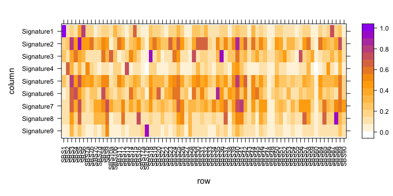

This workflow includes instructions for 1) running HDP chains, 2) extracting HDP signatures, 3) deconvoluting HDP signatures to PCAWG reference, 4) fitting reference sigantures for each samples, and 5) plotting signatures onto phylogenetic trees.


``` r
options(stringsAsFactors = F)
library(hdp)
library(RColorBrewer)
library(ggtree)
library(lsa)
library(lattice)
```

### 1. Run HDP chains

This part was submitted to cluster using the following shell script:

``` r
for i in {1..10}
do
     bsub  -q normal -o $i.log -e $i.err -n1 -R"span[hosts=1] select[mem>2000] rusage[mem=2000]" -M2000 /software/R-3.6.1/bin/Rscript hdp_noprior.R [inupt_matrix] $i [output_prefix]
done
```


``` r
mut_file<-commandArgs(T)[1]
iter <-as.numeric(commandArgs(T)[2])
out <-as.character(commandArgs(T)[3])

input_for_hdp<-read.table(mut_file)
# Only use samples with over 50 mutations
input_for_hdp=input_for_hdp[apply(input_for_hdp,1,sum)>50,]
ppindex <- c(0, rep(1, nrow(input_for_hdp)))
cpindex <- c(1, rep(2, nrow(input_for_hdp)))


hdp_mut <- hdp_init(ppindex = ppindex, # index of parental node
                    cpindex = cpindex, # index of the CP to use
                    hh = rep(1, 96), # prior is uniform over 96 categories
                    alphaa = rep(1, length(unique(cpindex))), # shape hyperparameters for 2 CPs
                    alphab = rep(1, length(unique(cpindex))))  # rate hyperparameters for 2 CPs

hdp_mut <- hdp_setdata(hdp_mut,  
                       dpindex = 2:numdp(hdp_mut), # index of nodes to add data to
                       input_for_hdp) # input data (mutation counts, sample rows match up with specified dpindex)

hdp_activated <- dp_activate(hdp_mut, 1:numdp(hdp_mut), initcc=10, seed=iter*200)

chlist <- hdp_posterior(hdp_activated,
                        burnin=20000,
                        n=100,
                        space=1000,
                        cpiter=3,
                        seed=iter*1e3)
saveRDS(chlist, paste0(out,iter,".rds"))
```

### 2. Visualise HDP results

``` r
chlist <- vector("list", 10)
for (i in 1:10){
  chlist[[i]] <- readRDS(paste0("./chlist_noprior_without_brunners_glands_",i,".rds"))
  }

mut_example_multi <- hdp_multi_chain(chlist)

lapply(chains(mut_example_multi), plot_lik, bty="L", start = 1000)
```

``` r
lapply(chains(mut_example_multi), plot_numcluster, bty="L")
```

``` r
lapply(chains(mut_example_multi), plot_data_assigned, bty="L")
```

``` r
mut_example_multi <- hdp_extract_components(mut_example_multi)
plot_comp_size(mut_example_multi, bty="L")
```


``` r
sub_vec = c("C>A","C>G","C>T","T>A","T>C","T>G")
ctx_vec = paste(rep(c("A","C","G","T"),each=4),rep(c("A","C","G","T"),times=4),sep="-")
full_vec = paste(rep(sub_vec,each=16),rep(ctx_vec,times=6),sep=",")
trinuc_context <- full_vec 
group_factor <- as.factor(rep(c("C>A", "C>G", "C>T", "T>A", "T>C", "T>G"),
                              each=16))

mut_colours <- c(RColorBrewer::brewer.pal(10, 'Paired')[seq(1,10,2)], 'grey70')


plot_comp_distn(mut_example_multi, cat_names=trinuc_context,
                grouping=group_factor, col=mut_colours,
                col_nonsig="grey80", show_group_labels=TRUE)
```

<!-- --><!-- --><!-- --><!-- --><!-- --><!-- --><!-- --><!-- --><!-- --><!-- -->

### 3. Deconvolute HDP signatures

``` r
# Load reference signatures, this can be downloaded from COSMIC website
ref=read.csv("../../public/pcawg_signatures_v3.1.txt", header=T, stringsAsFactors = F, sep='\t')
features<-lapply(1:dim(ref)[1],function(idx){
  paste(unlist(strsplit(as.character(ref[idx,2]),""))[1],"[",as.character(ref[idx,1]),"]",unlist(strsplit(as.character(ref[idx,2]),""))[3],sep = "")
})
features<-unlist(features)
ref<-ref[,-1]
ref<-ref[,-1]
rownames(ref)<-features

ref=as.data.frame(ref)


ref<-apply(ref,2,as.numeric)
ref[is.na(ref)]=0
rownames(ref)<-features
mut.cols = rep(c("dodgerblue","black","red","grey70","olivedrab3","plum2"),each=16)

# Load HDP signatures
hdp_exposures=mut_example_multi@comp_dp_distn[["mean"]][2:nrow(mut_example_multi@comp_dp_distn[["mean"]]),]
hdp_sigs=t(mut_example_multi@comp_categ_distn[["mean"]][2:nrow(mut_example_multi@comp_categ_distn[["mean"]]),])
rownames(hdp_sigs)<-features

input_for_hdp<-read.table('./input_for_hdp_without_brunners_glands.txt',check.names = F)
input_for_hdp=input_for_hdp[apply(input_for_hdp,1,sum)>50,]

rownames(hdp_exposures)=rownames(input_for_hdp)
colnames(hdp_sigs) = paste0('Signature',c(1:9))
rownames(hdp_sigs) = rownames(ref)

write.table(hdp_sigs,"./HDP_results/hdp_sigs.txt",quote=F)
write.table(hdp_exposures,"./HDP_results/hdp_exposures.txt",quote=F)


# Assess cosine similarities for all reference signatures
cosine_matrix=data.frame(matrix(nrow=ncol(hdp_sigs), ncol=ncol(ref)))
rownames(cosine_matrix)=colnames(hdp_sigs)
colnames(cosine_matrix)=colnames(ref)

for (n in 1:nrow(cosine_matrix)) {
  for (m in 1:ncol(cosine_matrix)) {
    cosine_matrix[n,m] <- cosine(x=hdp_sigs[,rownames(cosine_matrix)[n]],
                                 y=ref[,colnames(cosine_matrix)[m]])
  }
}

write.table(cosine_matrix, "./sigs/Cosine_similarities.txt",sep="\t",quote=F)

# Plot output
color.palette = colorRampPalette(c("white", "orange", "purple"))
levelplot(t(cosine_matrix[dim(cosine_matrix)[1]:1,]),col.regions=color.palette, aspect="fill", scales=list(x=list(rot=90)))
```

<!-- -->


``` r
# First iteration; decomposed hdp sigs into all suspected sigs 
gdsigs=c("SBS1","SBS2", "SBS5", "SBS13","SBS18","SBS88","SBS35","SBS40", "SBS41","SBS17b")


signatures=t(ref[,gdsigs])

profiles=hdp_sigs

sigs_to_decompose=rowSums(cosine_matrix>0.9)
for(n in 1:nrow(cosine_matrix)){
  print(paste0(rownames(cosine_matrix)[n],": ",paste(colnames(cosine_matrix)[cosine_matrix[n,]>0.9],collapse=",")))
}
```

```
## [1] "Signature1: SBS1"
## [1] "Signature2: SBS5"
## [1] "Signature3: SBS18,SBS36"
## [1] "Signature4: "
## [1] "Signature5: "
## [1] "Signature6: "
## [1] "Signature7: "
## [1] "Signature8: SBS88"
## [1] "Signature9: SBS17b"
```

``` r
signature_fractionR1 = matrix(NA,nrow=nrow(signatures),ncol=length(colnames(hdp_sigs)))
rownames(signature_fractionR1) = rownames(signatures)
colnames(signature_fractionR1) = colnames(hdp_sigs)
maxiter <- 1000

for (j in 1:length(colnames(hdp_sigs))) {
  freqs = profiles[,j]
  freqs[is.na(freqs)] = 0
  # EM algowith to estimate the signature contribution
  alpha = runif(nrow(signatures)); alpha=alpha/sum(alpha) # Random start (seems to give ~identical results)
  for (iter in 1:maxiter) {
    contr = t(array(alpha,dim=c(nrow(signatures),96))) * t(signatures)
    probs = contr/array(rowSums(contr),dim=dim(contr))
    probs = probs * freqs
    probs[is.na(probs)] = 0
    old_alpha = alpha
    alpha = colSums(probs)/sum(probs)
    if (sum(abs(alpha-old_alpha))<1e-5) {
      break
    }
  }
  # Saving the signature contributions for the sample
  signature_fractionR1[,j] = alpha
}

# Plot initial deconvolution 
color.palette = colorRampPalette(c("white", "orange", "purple"))
levelplot((signature_fractionR1[nrow(signature_fractionR1):1,]),col.regions=color.palette, aspect="fill", scales=list(x=list(rot=90)))
```

<!-- -->

``` r
# Select which signatures to decompose into reference signatures
sigs_to_deconv=names(sigs_to_decompose)[sigs_to_decompose!=1]
# Hard-code the dirty SBS1 signatures(HDP Siganture 1) to be decomposed
sigs_to_deconv = unique(c(sigs_to_deconv,'Signature1'))

sigs_deconv_R2=list()
for(n in colnames(hdp_sigs)){
  if (n %in% sigs_to_deconv){
    sigs_deconv_R2[[n]]=rownames(signature_fractionR1)[signature_fractionR1[,n]>0.1]
  }
  else{
    sigs_deconv_R2[[n]]=colnames(cosine_matrix)[cosine_matrix[n,]==max(cosine_matrix[n,])]
  }
  
}
sigs_deconv_R2
```

```
## $Signature1
## [1] "SBS1"  "SBS5"  "SBS18"
## 
## $Signature2
## [1] "SBS5"
## 
## $Signature3
## [1] "SBS18"
## 
## $Signature4
## [1] "SBS2"  "SBS13"
## 
## $Signature5
## [1] "SBS5"  "SBS40"
## 
## $Signature6
## [1] "SBS5"  "SBS18" "SBS35"
## 
## $Signature7
## [1] "SBS5"  "SBS18" "SBS41"
## 
## $Signature8
## [1] "SBS88"
## 
## $Signature9
## [1] "SBS17b"
```

``` r
# Combine decomposed and undecomposed signatrues
ref_sigs_R2=sort(unique(unlist(sigs_deconv_R2)))
signature_fractionR2=matrix(0,ncol=length(colnames(hdp_sigs)),nrow=length(ref_sigs_R2))
rownames(signature_fractionR2)=ref_sigs_R2
colnames(signature_fractionR2)=colnames(hdp_sigs)

# Repeat the deconvolution with the identified constitutive signatures
for(s in colnames(hdp_sigs)){
  gdsigs <- sigs_deconv_R2[[s]]
  signatures <- t(ref[,gdsigs])
  
  if (length(gdsigs)==1){
    signature_fractionR2[gdsigs,s] = 1
    next
  }
  signature_fraction = matrix(NA,nrow=nrow(signatures),ncol=length(colnames(hdp_sigs)))
  rownames(signature_fraction) = rownames(signatures)
  colnames(signature_fraction) = colnames(hdp_sigs)
  maxiter <- 1000
  
  freqs = profiles[,s]
  freqs[is.na(freqs)] = 0
  
  alpha = runif(nrow(signatures)); alpha=alpha/sum(alpha) # Random start (seems to give ~identical results)
  for (iter in 1:maxiter) {
    contr = t(array(alpha,dim=c(nrow(signatures),96))) * t(signatures)
    probs = contr/array(rowSums(contr),dim=dim(contr))
    probs = probs * freqs
    probs[is.na(probs)] = 0
    old_alpha = alpha
    alpha = colSums(probs)/sum(probs)
    if (sum(abs(alpha-old_alpha))<1e-5) {
      break
    }
  }
  # Saving the signature contributions for the sample
  signature_fractionR2[gdsigs,s] = alpha
  reconsbs <- rep(0,96)
  for (g in gdsigs) {
    reconsbs=reconsbs+(ref[,g]*alpha[g])
  }
  cosine_reconst=cosine(x=reconsbs, y=hdp_sigs[,s])
  print(paste0(s,": ",cosine_reconst))
  par(mfrow=c(length(alpha)+2,1))
  par(mar=c(1,2,4,1))
  barplot(hdp_sigs[,s], col=mut.cols, main=paste0("HDP ",s),names.arg="")
  barplot(reconsbs, col=mut.cols, main=paste0("Reconstituted ",s," cosine similarity to original: ", round(cosine_reconst, digits=2)))
  for (g in gdsigs) {
    barplot(ref[,g], col=mut.cols, main=paste0("PCAWG ", g, " accounts for ", round(alpha[g], digits=2)))
  }
}
```

```
## [1] "Signature1: 0.993484111841227"
```

<!-- -->

```
## [1] "Signature4: 0.992401851948184"
```

<!-- -->

```
## [1] "Signature5: 0.808950208119317"
```

<!-- -->

```
## [1] "Signature6: 0.896920938160129"
```

<!-- -->

```
## [1] "Signature7: 0.899686871372706"
```

<!-- -->

``` r
saveRDS(sigs_deconv_R2,"./sigs/hdp2refsigs.Rdata")
final_sigs=ref[,ref_sigs_R2]

write.table(final_sigs,"./sigs/final_sigs.txt",quote = F)
write.table(signature_fractionR2,"./sigs/signature_fractionR2.txt",quote = F)
```

### 4. Refit reference signatures

``` r
library(sigfit)
library(RColorBrewer)
library(ape)
library(ggtree)
data("cosmic_signatures_v2")

#------------refitting for each branch-------
final_sigs=t(read.table("./sigs/final_sigs.txt",check.names=FALSE))
hdp_counts=read.table('./input_for_hdp_without_brunners_glands.txt',check.names = F)
hdp_counts=hdp_counts[apply(hdp_counts,1,sum)>50,]

hdp_exposures=read.table("./HDP_results/hdp_exposures.txt")
rownames(hdp_exposures)=rownames(hdp_counts)
colnames(hdp_exposures)=paste0("Signature",0:9)

hdp2ref=readRDS("./sigs/hdp2refsigs.Rdata")

sig_order=1:10
names(sig_order)=c("SBS1","SBS5","SBS18","SBS2","SBS13","SBS88","SBS35","SBS40","SBS41","SBS17b")

colourCount = nrow(final_sigs)
getPalette = colorRampPalette(brewer.pal(8, "Set3"))
all_cols=getPalette(8)
all_cols=c(all_cols,"firebrick","magenta")
final_sigs = final_sigs[names(sort(sig_order[rownames(final_sigs)])),]
names(all_cols)=rownames(final_sigs)
all_cols


patients=unique(substr(rownames(hdp_counts),1,7))

#------------refitting for each branch-------
ori_matrix=read.table('./input_for_hdp_without_brunners_glands.txt',check.names = F)

all_counts=as.data.frame(ori_matrix[apply(ori_matrix,1,sum)>50,])
colnames(all_counts)=colnames(cosmic_signatures_v2)

for (patient in patients[1:length(patients)]){
  hdp_exposures_tmp=hdp_exposures[rowSums(hdp_counts)>200,]
  hdp_sigs_final=colnames(hdp_exposures_tmp)[colSums(hdp_exposures_tmp[grepl(paste0(patient,"_"),rownames(hdp_exposures_tmp)),]>0.05)>0]
  for (sample in grep(paste0(patient,"_"),rownames(all_counts),value=T)){
    if (!sample %in% c('PD43851_1','PD43851_4','PD43851_14','PD43851_15','PD46565_8')){
      next
    }
      hdp_sigs_present=colnames(hdp_exposures)[hdp_exposures[sample,]>0.05]
      hdp_sigs_present=hdp_sigs_present[hdp_sigs_present %in% hdp_sigs_final]

      ref_sigs_present=unique(c(unlist(hdp2ref[hdp_sigs_present])))
      ref_sigs_present = ref_sigs_present[ref_sigs_present %in% rownames(final_sigs)]

      counts_patient=all_counts[sample,]
      colnames(counts_patient)=colnames(cosmic_signatures_v2)
      ref_sigs_present=names(sort(sig_order[ref_sigs_present]))
      
      fit=fit_signatures(counts=counts_patient,signatures = final_sigs[ref_sigs_present,],
                         iter = 20000,warmup = 10000,model="poisson",chains = 5)
      pars <- retrieve_pars(fit,par = "exposures",hpd_prob = 0.95)
      exposure_matrix<-t(pars$mean[,ref_sigs_present])
    
      ref_sigs_present_final=rownames(exposure_matrix)[exposure_matrix[,]>0.05]
    
      if (sum(exposure_matrix[rownames(exposure_matrix) %in% c('SBS2','SBS13'),])>0.05){
        ref_sigs_present_final=unique(c(ref_sigs_present_final,"SBS2","SBS13"))
      }
    
      ref_sigs_present_final=names(sort(sig_order[ref_sigs_present_final]))
      if (length(ref_sigs_present_final) != length(ref_sigs_present)){
        fit=fit_signatures(counts=counts_patient,signatures = final_sigs[ref_sigs_present_final,],
                           iter = 20000,warmup = 10000,model="poisson",chains = 5)
        pars <- retrieve_pars(fit,par = "exposures",hpd_prob = 0.95)
        exposure_matrix<-t(pars$mean[,ref_sigs_present_final])
      }
        write.table(exposure_matrix,paste0("./sigs/sig_attribution/branch/fit_branch_",sample,".txt"),quote = F,sep='\t')
        plot_all(mcmc_samples = fit,
                 out_path = "./sigs/sig_attribution/branch",
                 prefix = paste0("Fitting_branch_",sample))
  }
}
```

### 5. Plot signatures onto phylogenetic trees

``` r
for(patient in patients){
  tree=try(read.tree(paste0("./tree/",patient,"_snp_tree_with_branch_length.tree")))
  tree_df=fortify(tree)
  
  
  samples = grep(paste0(patient,"_"),rownames(hdp_counts),value=T)
  exposure_matrix_sample=data.frame(matrix(ncol = length(samples), nrow = nrow(final_sigs)))
  rownames(exposure_matrix_sample) <- names(sig_order)
  colnames(exposure_matrix_sample) <- samples
  
  for (sample in samples){
    exposures = read.table(paste0("./sigs/sig_attribution/branch/fit_branch_",sample,".txt"),check.names=FALSE)

    for (sig in names(sig_order)){
      if (sig %in% rownames(exposures)){
        exposure_matrix_sample[sig,sample] = exposures[sig,sample]
      }
      else{
        exposure_matrix_sample[sig,sample]=0
      }
    }
  }
  
  exposure_matrix_sample = exposure_matrix_sample[rowSums(exposure_matrix_sample)>0,]
  write.table(exposure_matrix_sample,paste0("./sigs/sig_attribution/branch/fit_branch_",patient,".txt"),sep = '\t',quote=F,)
  cols=all_cols[rownames(exposure_matrix_sample)]
  ref_sigs_present_final=rownames(exposure_matrix_sample)
  branches=unlist(strsplit(samples,split="_"))[c(F,T)]
  
  pdf(paste0("./tree/",patient,"_tree_with_ref.pdf"))
  plot(tree,label.offset=0.01*max(tree_df$x),show.tip.label=T)
  for (k in 1:length(samples)){
    n=as.numeric(branches[k])
    x_end=tree_df$x[n]
    x_start=tree_df$x[tree_df$parent[n]]
    x_intv=x_end-x_start
    y=node.height(tree)[n]
    tipnum=sum(tree_df$isTip)
    for (s in ref_sigs_present_final){
      x_end=x_start+exposure_matrix_sample[s,samples[k]]*x_intv
      rect(ybottom=y-min(0.02*tipnum,0.4),ytop=y+min(0.02*tipnum,0.4),xleft=x_start,xright=x_end,col=cols[s],lwd=0.5)
      x_start=x_end
    }
  }
  axisPhylo(side = 1,backward=F)
  title(xlab=paste0(patient," (Age ",unique(data$age[data$patient==patient]),")"))
  legend("topright",title="Signatures", legend=ref_sigs_present_final, fill=cols, bty="n",cex=0.8, ncol=1, xjust=0.5)
  dev.off()
}
```
